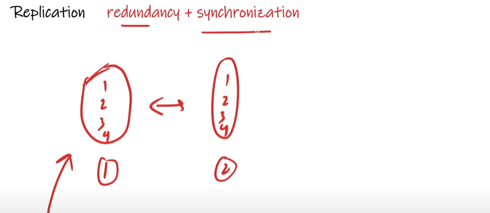

# Redundancy

    Redundancy is simply the duplication of nodes or components so that when a nodes or component fails, the duplicate
    nodes is available to service customers.

    suppose i have a server on that server requests are coming, i have putted a same one more server which mean same code i deployed on 
    a different server so, now we do have 2 servers. so, redundancy means when our one server got failed then all the requests will go
    to an another server. so, same code has been deployed on a both servers.

    2 types:
        1. Active Redundancy
                Active Redundancy is considered when each unit is operating/active and responding to the action. 
                Multiple Nodes are connected to a Load Balancer and each units receives an equal loads.

                suppose i am hitting a google.com, so request went to a server and giving back a response. suppose we have
                a 3 google's server which means they scalled it horizontally, so when all the 3 servers are in active states
                always then we will say active redundancy, which mean all 3 servers are ready to receiving a requests.
                    so when any requests come it will go to load balancer then load balancer will see on which server need
                    to send a requests to balancing a loads on a server. so, this is called active redundancy. 

        2. Passive Redundancy
                Passive Redundancy is considered when one node is active or operational and the other is not operating. during
                the breakdown of the active node, the passive node maintains availability by becoming the active node.  
                    In passive redundancy requests will go to one server so, there is a 2 nodes or server and both are redundant. 
                    both servers having same duplicate codes when user all requests will go to one server and the second server
                    will be in sleeping state so, in case first serevr got down so all requests will go to second serever which
                    were in an sleeping/inactive state. 
                so, In passisve redundancy one server will be in active and second server will be in an inactive state, so once first
                server will go down then our server which was in inactive state will become in an active state and all requests will
                go to the second server.
    so, this is only a Redundency which mean duplication of nodes means duplication of servers.

# Replication (Redundancy + Synchronization)

    Replication means redundancy plus synchronization. suppose we have a database server and we have stored a numbers into it.
    we though like in future we should do redundancy which mean duplication so we copy the same data on second server as well. so,
    we have a redundant servers of database. 
        now one request came to 1st db server to add number 4 so now on db server 1 having 4 data 1,2,3,4.. but in db server 2 is
        having only 3 numbers 1,2,3...which mean both servers are not in sync. so we have to synchronized both of the servers. so in server
        2 we are adding manually 4 . so this is a replication mean redundancy + synchronization. which mean all the time data should be same
        on each servers. 
  

    suppose If we have a server where code base has been deployed or our app jar has been deployed so there is no need to do
    synchronization bcz there is a jar and the same jar has been deployed on 10 servers so why we need synchronization. But If we
    have a Database then in database we required synchronization. so simply we can say
    *****   In case of databases we uses Replication *****
    
    same like Redundancy Replication is also having of 2 Types-
    
    1. Active Replication
            active means how many nodes you do have all nodes are ready to accepting a requests. 
            In database there will be 2 requests READ & WRITE.
            In case of active suppose requests are coming and we do have 3 servers so all 3 servers will be in a active states 
            and all 3 were doing Read - Write operations. and obviously all are in a synchronized states. 
        
    2. Passive Replication
            In case of Passive Everey read-write will be having through master. 
            In case of Passive one will be Master and Rest all be a Slave nodes.
            Suppose if we have 4 nodes then one will be master and rest 3 will be slaves. 
            The Master will be only responsible for all read & write operations.
            If master will go down then one of the nodes from slaves will become a master.
            Master-slave communication can be either synchronous or asynchronous. 
            The difference is simply the timming of propagation of changes.
            If the changes are made to the master and slave at the same time, It is synchronous.
            If changes are queued up and written later, It is asynchronous.

       In case of passive every read-write opertaions will be performed by a master. now who is master he is doing read-write operations
       then the changes we have to synchronized to all the slaves nodes. so how we are bringing all the slave nodes in sync. 
            If we bring immediately then we say this is synchronous and we ran a schduler and if we bring the changes later then we 
            can say this is asynchronous. 

            If later by using scheduler if you are synchronizing all the slave nodes then we say master-slave replication is an
            asynchronous. 

    we saw as we are doing replication and redundancy now The client is sending a REQUEST then how client will get to know that 
    on which node he should send a REQUEST. 

    suppose in case of Redundancy you have deployed a jar on 3 serevrs. I am sending a REQUESTS then on which Node REQ.
    will go so, who is going to decide that will be decided by load Balancer. 