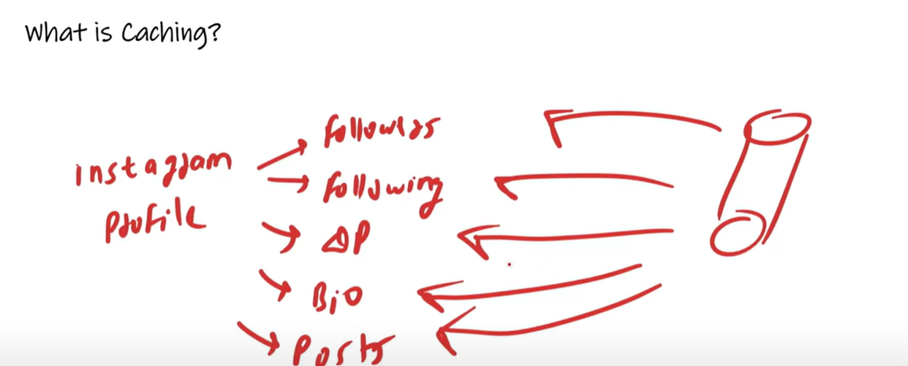
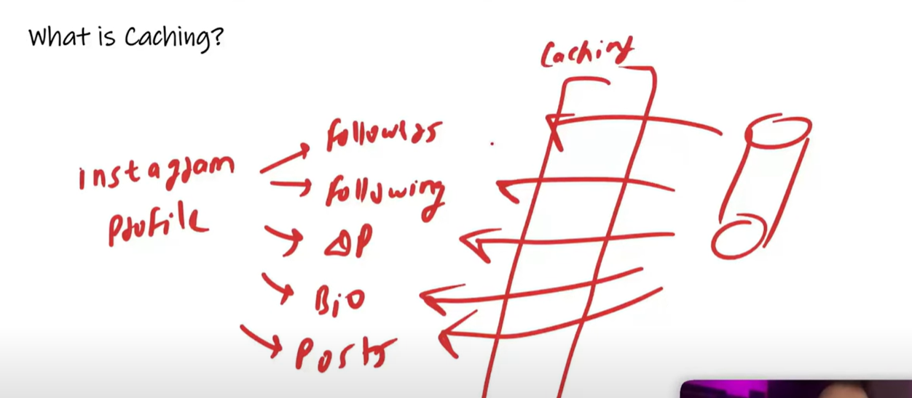
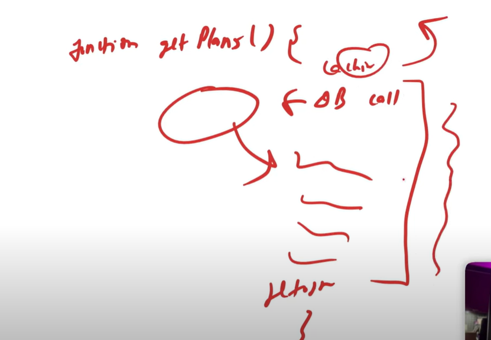
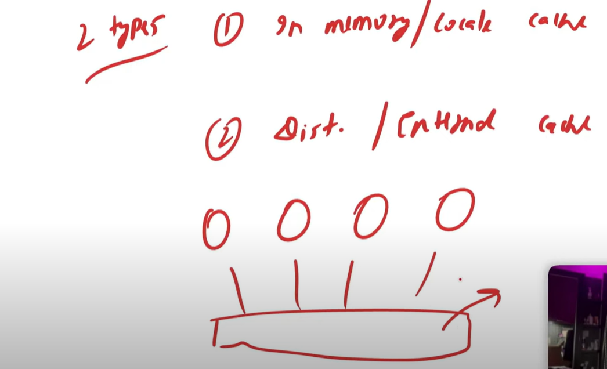

# Caching

    suppose you have clicked on an Instagram profile, your Bio is visible, your DP is visible, all your Posts are visible
    or If you are looking to a profile of some other person Bio is visible, DP is visible, Posts are visible, How many followers he has, 
    How many following he has all are visibles. untill there is no change in his profile like there is no post come, no bio has been change,
    No Followers has been increase or decrease, no Following has been increase or decrease till then his Profile behave like a static i.e
    It will remain as it is. 

    so If you are clicking on his profile 10 times then every time it will take times to fetch from the database. Every components like Follower,
    Following, DP, Bios, Posts all thses things are coming from the database one by one. since there is no change in all these components everything
    is coming from tha database so it takes time.

   

    we can bring all these things from cache instead of database like first time when you click on profile on instagram it will come from databaase.
    but when it will come from database then you will add caching 
   
   
    you will add caching layer in between, so next time so next time when you click profile it will not come from database but from caching.

   # Caching is FAST because we use Primary Memory RAM in Caching

    you must have seen the well established application like instagram, whatsapp or facebook, flipkart. amazon take less time to load data because
    they use caching.

 # Another Example:-

    In Gaana App in GPlus Profile so, once we click on User Profile it shows how many transactions history he has, How many Queue Plans
    he have, How many gaana plus subscription he bought how much is his validity all these things are in his user profile.

    Now all these things are handled by different APIs.

   

    Transaction History will come from different API, Queue Plans will come from different APIs, It's validity is comes from different
    APIs. so, If we don't add Caching It will take time. so, first time when we call it will load from DB then we add the caching layer. 
    then there will be no network calls. things will not comes from database. There is a caching layer in between and response will come 
    directly from there. 
        we can delete the caching manually, when the person takes a new subscription. 

 # When do we use caching?

        It is used to store HTML & CSS etc. It is used to store API Responses and It is used to store Database Query. 

        you open the Netflix Page and click to see the plans. How many plans are there so, 90% of the plans do not change they changed 
        in a year so why should we fetch from the database save it directly in a caching why do we need to go through the code, instead return
        the caching response first.

   

        suppose In Netflix getPlans() function is in there code. there are 3 to 4 plans all are need to be fetched. what will happened
        a call will come from DB some response will come then you are doing customizung response to make beautiful instead of doing this first
        check either this is there in caching or not if caching is there then return it from the function first line itself there is no need 
        to execute all function defined statements. 

  

        If we make some changes in a Plan then we also do it through the code. we will write in the function if this function run getPlan
        will not run. suppose i am writing a function setPlan() In setPlan() this caching has to be deleted so whenever this getPlan()
        runs it will not be deleteing a cache then it will go to database and db will be found so we will set in cache so from next
        time data will come from caching. 
            so in this way the response from the database and the query of the database we can also save into the caching the response of
            API also can be save in caching. we can save html and css etc in caching. 

   # Why Caching Fast ??
        
        It's simple thing your Code will not run. so there is no process to process call, API call, network call  nothing.
        Obviously it will be fast because the Caching Happen in RAM in RAM is fast. 

  # 2 Types of caching

        1. In Memory / Localmcache
        
                If we call In Memory we saved it locally. there will be a server it will store locally in it.

   

        2. Distributed / External cache

                Distributed means suppose i have many servers there are many nodes which are handling a requests. when i hit google.com
                then request will go to all 4 nodes. since there are 4 servers i have a distributed systems so for this we need a distributed
                cache, so this is a cache which all the nodes will be sharing. so in this case its a distributed cache for Example - MemCache.
                Aerospike cache and redis cache.
                

        

 # When to use Cache ??
   
   1. Read Intensive-

    If an Application is READ intensive that means it is being used for reading and viewing like Twitter, Wikipedia & Times of India. 
    Here everyone is just watching. so millions are peoples are reading times of India so every time going to database is really
    time consuming and costly. do In this scenario we will use Cache

   2. Static Contents-

     Storing html and Images in cache.
 
 # Where to use Caching ??

   1. Application Server Cache
        
            we are reading it through the Application server cache that means we are saving database queries, we are saving API responses,
            we are saving the responses in cache we call it application server cache.   
    
   2.  CDN (Content Delivery Network)

            It is not a kind of cache. I am in India and there is one server in US so it will take time to bring from US. 
            so, there is geographically located server we called them CDN, so the static content which does not change we
            served it through GDN. for example suppose you type amazon.com then amazon logo appear you know we can all those
            small things serevr through GDN. 

        
    

    