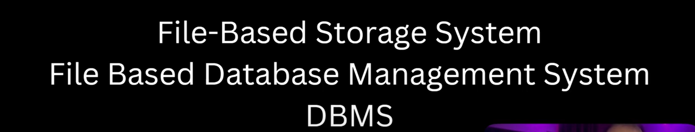
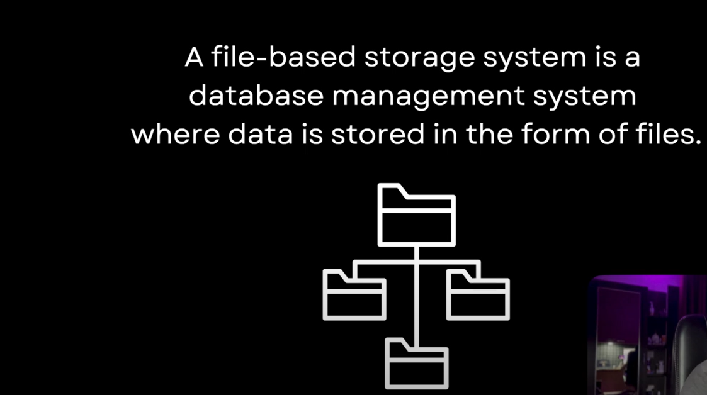

# File based storage system (File Based Database Management System)

# Challenges of File-Based Storage System

   1. Data Redundancy (update anomaly, delete anomaly leading to data inconsistency)

        suppose you have two folders abc & xyz and they are in the same college. suppose there is a .txt file in both 
        of the folders where college details are there. suppose tomorrow there is some changes came so abc has been changed 
        but xyz forgot to change so there will be a data anomaly. 
            suppose you have a photos, and you kept in 2 to 3 folders, so while deleting from 2 folders you have deleted
            but forgot to delete from the third folder, so it leads to delete anomaly. 

        so, this is the big challenge in File-Based Storage System bcz update /delete happened in some places but not at all. 

   2. Poor Security

        same data are present in the system which causes a possibility of data breaches by unauthorised user.

         you have deleted from one place but not deleted from another place, so another user will come and see your data. 
        
   3. Slow (The speed of file-based system is very slow)

        The speed is very slow, due to these challenges, data retrieval is not very efficient. 

   # To Overcome this File Based Storage System RDBMS came into picture. 