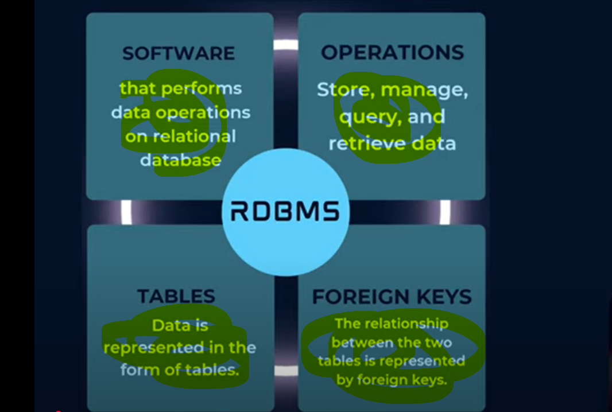

# RDBMS - Relational Database Management System

    We saw File based storage system and there disadvantages - 
        - slow speed
        - redundancy
        - poor security

    To overcome theses RDBMS came into picture

    
 # What is RDBMS?

    SOFTWARE - RDBMS is a SOFTWARE that performs some data operations on relational databases.

    OPERATIONS - RDBMS performs OPERATION like Storage, Manage, Query and Retrieve data.

    TABLES - RDBMS store data in form of a table. Data is Represented in form of Table. all data are related to each other.

    FOREIGN KEYS - In RDBMS The relationship between the two tables is represented by foreign keys.

  

 # Advantages of RDBMS

   1. No Data Redundancy and Inconsistency
   
   2. Data Searching (Built in Searching Capabilities)

          In File Based storage system there is no build in capabilities we have to write a program to make search happen. But In
            RDBS with the help of Query we can search the data which is built-in.

   3. Data Concurrency
    
          In File based system suppose 2 person has opened the same file so first person did the changes and then second person
            done the changes But In RDBMS there is a LOCKING system till first transaction not get completed second transaction
            won't get performed.

   4. Data Integrity

          Ex- To maintain data integrity numeric columns won't have alphanumeric data. we can put some constraint in a column
            that in this column only numeric value can store so alphabet can't store. In file based system there is no process 
            who can make sure this. 

 # Problems with RDBMS?

   1. Rigid Schema

          There is no flexibility. Every Tablew will be having a particular structures so we have to follow that structure only.
            But in NoSQL we can store nested data also suppose we have a table called Student where field Id, name and city suppose tomorrow
            I want to store marks, pan-card no then what we have to do we have to change the table again whole structure we have to change 
            we can't add a pan card no. of any particular student so this provide a rigid schema no flexibility. 
                In NoSql we can store even PanCard or Adhar card also so no need to change schema because is there is no schema in NOSQL
                Database so In RDBMS we have to write a Query to change schema then only we can write panacrd or adhar card number. 

   2. High Cost

   3. Scalability Issues (Horizontal Scaling / Sharding is very difficult)

          This is not Highly scalable. we can only do Vertical Scaling. suppose we have a computer where I am having 1 TB SSD,
            suppose I have created a Database Server where my all query is running suppose tomorrow too many data come so np
            today i am haing 1 TB tomorrow i will do 10TB or 100TB so we have a Vertical Scaling here. but we know Vertical
            scaling having some LIMITS so this not a good Option.

          Now other option remain is Horizontal Scaling or Sharding 

       # let's see WHY Horizontal SCALING is challenging in RDBMS? 

           suppose 1 TB data is going to store so what i will do I will bring systems of 100-100 GB and i will distribute the data
            among them this is called horizontal scaling. we will add new MACHINES unlike vertical scaling where we were add on
            resources in a single machine. so, In case of horizontal scaling new-new machine will come so there will be no changes 
            in an additional machines. Now let's see what is the problem then in RDBMS for a Horizontal scaling...

           For Example There is an Amazon Customers and their Orders. so suppose only 2 Table exists CUSTOMER and ORDER. 
            Now we have to Horizontally Scale an Order Table. what is mean by Order table Horizontally scaling here suppose there is
           a 10 crores entries in an Order table. Now suppose we have 10 TB Data and we have to distribute in a 10 Systems. so suppose
            every system is having 1 TB data so 10 TB means 10 Systems. so, i will put 1 TB data in each system so till now no issues.
           But we have one more Table CUSTOMER table which will have a mapping with Order table. so 1 particular order will get mapped 
            with a particular customer. so, since I have distributed/divided that Order table into a Multiple Systems or since for every
            ROW there will be mapping with a Customer table. so, In this Case I also have to distribute/divide a Customer Table also so
            There will a PROBLEM.
                Suppose I am a Customer My One Order will be in MACHINE A and Second Order will be in a MACHINE B Now My ENTRY Which is in
                a CUSTOMER Table Where we are going to keep in MACHINE A or MACHINE B or in BOTH, so this is a problem in case of
                Horizontal Scaling in RDBMS.

   # So This is The Problem in RDBMS 
        -Rigid Schema
        -High Cost
        -No Scalability

    To Resolve this we are going to use No-SQL so No-Scalability is the main Issue which we can overcome
    By Using No SQL DataBase.

