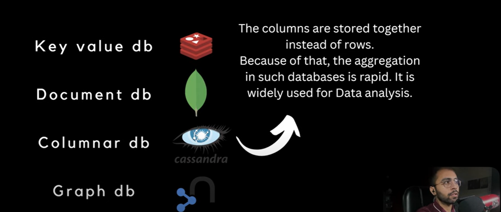
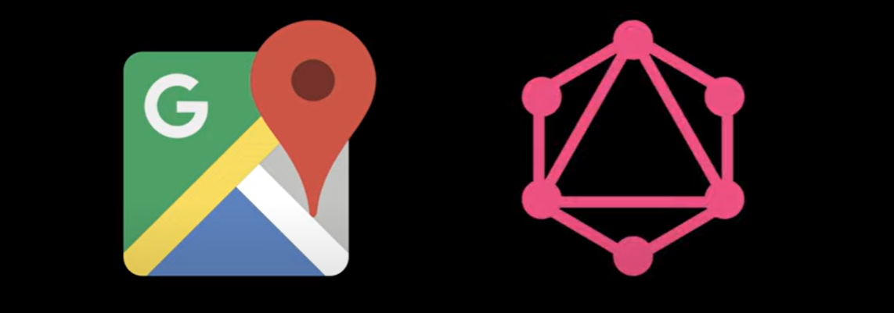

# NoSQL—It Stands for Non - SQL Database or Non-Relational Databases. 

    In RDBMS we stored Tables and Inside a table we stores a data.
    We can not scale either MySQL or Oracle or RDBMS. Horizontal Scaling we can achieve but more Complexity occurred. 
    To overcome this No-SQL come. It's a non-relational databases.

   NoSQL is the Umbrella Term comprising of Four Different Types of databases--

    1. Key - Value Database

    2. Document Database
    
    3. Columnar Database

    4. Graph Database

   # Key Value Database (Redis)

        In Key-value db, data will be stored in the form of Key and Value. 
        There will be a Key and corresponding to that key there will be one value.
        key-value database generally used for a CACHING.
        Example - redis
   
   # Document Database (MongoDB)

        Document db brings best of both RDBMS and NoSQL.
        It combines the Relationship concepts from RDBMS and dynamic schema and horizontal scaling
        from NoSQL databases.
        here there is no schema and table 
        Example - mongodb

   # Columnar Database

        The Columns are stored together instead of rows.
        Because of that, the aggregation in such databases is rapid.
        It is widely used for Data Analytics.
        generally In RDMS table rows are grouped but here columns will be grouped together.
        when we query on a subset of your data's columns.
        Because it just needs to read these specific columns.
        Columnar db conducts such quaries quickly(while row-based DB would have to read the entire data).
        Example - cassandra
   
        
        suppose i am trying to finding a max of salary in case of RDBMS it will read all the rows nut
        in case of columnar only salary columns will get read no id and name will get read. 
        In case of Machine Learning and Data analytics we uses casandra.

   # Graph Database

        Graph database represents and stores entities and relationships in the form of
        graph data structure.
        It is majorly used for social networks.
        When your data is in the form of a graph like social networks we use this.
        Example - neo4j

        suppose as example LinkedIn, my 1 degree connection is who is directly connected with me,
        2-degree connection who has connected with my connection. so this is a kind of network or graph. 
        so all peoples are connected like a graph so we uses Graph DB.

# Examples

    Google Map - all the places connected with each other thats the reason he gives all
                 the locations. when entities connected with each other like a graph we use graph db.
                 DB: Graph database
                 Ex: Neo4j

    LinkedIn -   DB: Graph database
                 Ex: Neo4j

    Cart in Shopping Website - graph we can't use because no entity connected 
                               columnar we can't use we are not doing data analysis.
                               document we can't use no nested things we are going to use.
                         so, we will use key-value pair redis db like this is item and that much quantity.
                               DB: Key-Value Database
                               Ex: Redis 

    ScoreCard - players with their scores
                DB: Key-Value Database
                Ex: Redis

    Machine Learning - Data Analytics we will use columnar. 
                       columns are grouped so perform operations on columns.
                       DB: Columnar Database
                       Ex: Cassandra

    Payments - In payments we need high consistency.
               so no-sql we won't use.
               DB: RDBMS
               Ex: Oracle

    

