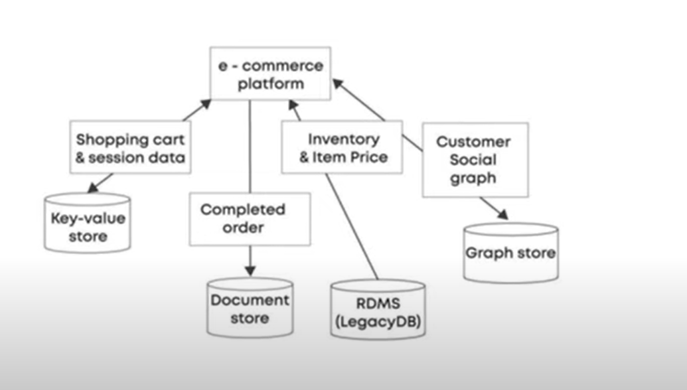

   Suppose we have an AApplication and their Requirements are not fulfilled with a Single kind of Database.
    
   We know there is a RDBMS and NoSQL Database.

   NoSQL is of four types - key-value, columnar, document and graph db.

   postgres - RDBMS
   redis - key_value db
   mongodb - document db
   cassandra - columnar db

   suppose our application requirement is not fulfilled with a single db then we will use a multiple database
   so that db or system we called polyglot db or polyglot system.

   Example: E - commerce platform

    In Cart Data - 
            we use key-value pair database - REDIS
    Completed Order or Order Details - 
            we saw order details so nested things and things are getting add on
            many order and things are vast.
            we use document database - MONGO DB
    Inventory and Item price - 
            In case of Payments we should use RDBMS
            because we need high consistency - RDBMS
    Customer Social Graph - 
            suppose customers are follow each other
            things are connected like a graph GRAPH DB - NEO4j

   # If our Application are using multiple different-different database then we say POLYGLOT PERSISTENCE.