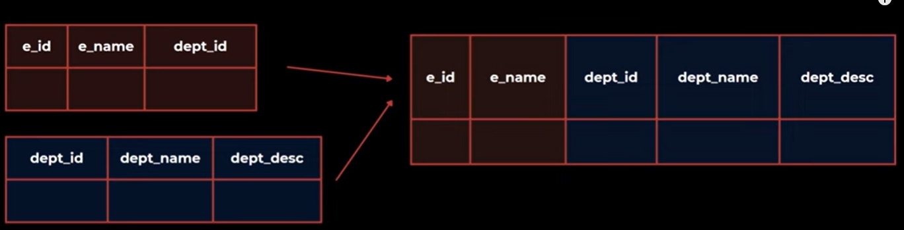
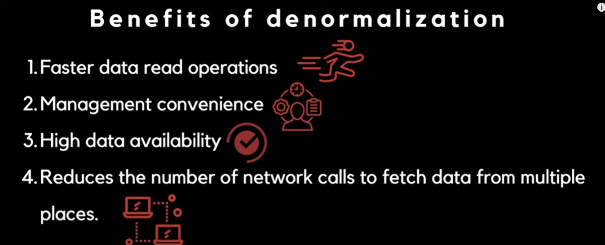

# Normalization 

    If you have a single table then you are going to break into multiple tables to reduce redendancy

    Putting Data in Multiple Tables to Avoid Redundancy

 # De-Normalization

    If you have a multiple tables then you have merged/converted to a single table called denormalization.

   
   
    It combines the data and organizes it in a single table.

    Denormalization is the process of adding Redundant data to the normalized relational database to optimise its performance.

    
 # Benefits of Denormalization

    Performance will get Increased using denormalization.

   Use-Case: we have 100 Employees and only 2 Departments 
             we have to find out the department description of employee name abc.

    ** First we will go to Employee Table and search Employee Name abc department Id
    ** Second we will go to the Department Table and search for particular department id and find the department description
    ** Because of 2 tables more time consuming because searching in 2 tables if we have a single table will take less time.
    ** There will be a Redundancy but query processing will be fast because of a one table.
    ** Since we will have only one table so management will be easy.
    ** since we are having one table so no need to worry about either available or not, data presents or not,
       available on another server or not, server is up or not...
    

 1. Faster Data Read Operations.

 2. Management Convenience.
   
 3. High data Availability

 4. Reduce the number of network calls to fetch data from multiple places.

# Challenges of Denormalization

    1. Redundant data - Wastage of Memory.

    2. It increases the complexity.

    3. Data Inconsistency.

    4. It will cause slow write operations since we will need to write multiple places due to redundancy.