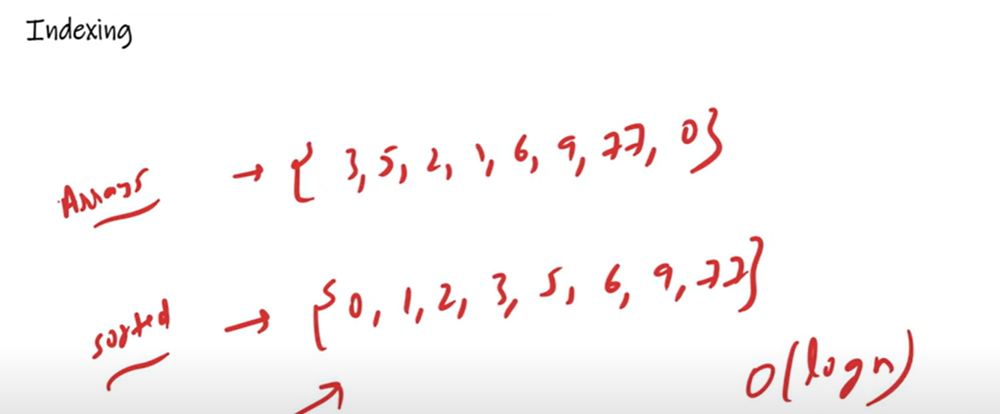
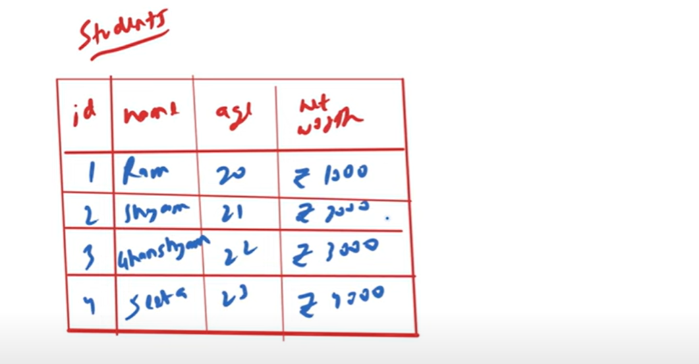
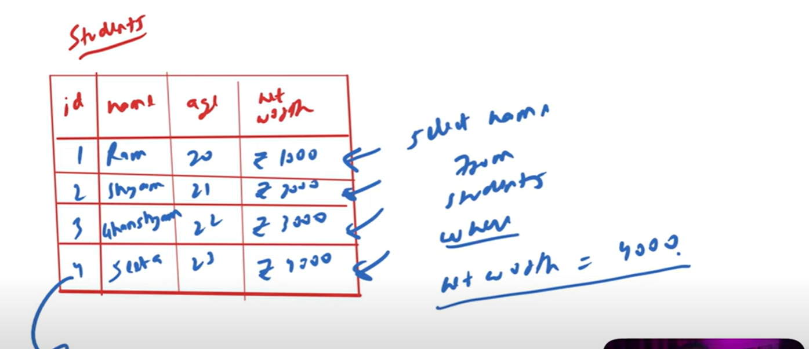
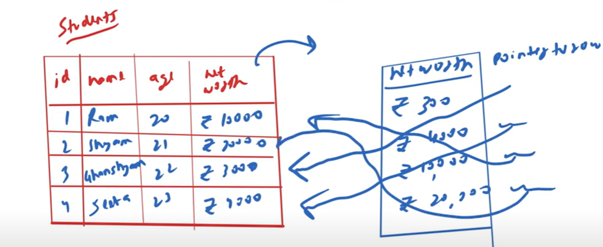
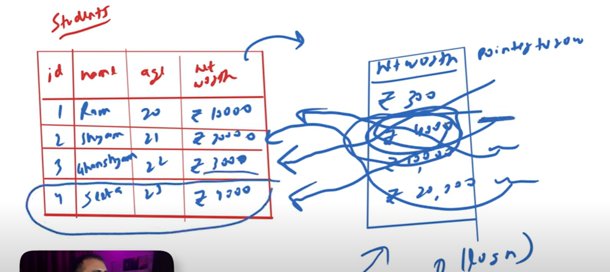

# Indexing

   Before Indexing, let's take one scenario...
   
   UseCase - 1
   -----------
   In your house, everything is unorganized. You have no idea where is your shocks, where your watch, where is your laptop is and
   all of sudden you are searching for a Bike's keys, so it will take time because data are unorganized.
   
   When you are going to a Medical STore and asking for a VITAMIN D tablet, then he gives it immediately because he knows where he kept
   because he has organized the data or medicines, but we have not. Unknowingly medical store person is using indexing....

UseCase - 2
-----------   
   suppose we have an unordered array—{3, 5, 2, 1, 6, 9, 77, 0}
   
   If I am searching for an element -1, then we will do linear search using loop.
   
   suppose we have 1 million of records and all are in unsorted order at the end last element is 3.
   
   suppose we are searching for element 3; it will take time—O(n)

   
   
   suppose If our array is in sorted order then we can apply binary search and time complexity—O(log n)
   
   So, Indexing is a way to implement binary search in our table.
   
   
 # USE CASE
 

    Suppose we have a table Students. there is a column Name with value Ram, Shyam, Ghanshyam and Sita.

   
   
    suppose we have a QUERY - SELECT name FROM Students WHERE net_worth = 4000

    *** Whenever in a Query WHERE clause comes which means we need to do searching. now how it will do searchimg it will go
        to salary column and search is network is 4000 if no then go to next line and do the same...
   
        If the last row is there with net-worth 4000, it will return that row.
   
    *** suppose if we have 10 millions of records and the desired row present at at end whose net worth is 4000 which mean in 
        this case he has to check all 10 millions of records to find the desired output so, it will take a lots of time.

    How our house was unorderwd, how our array was unorganized same this table also unorganized so what we can do is to optimise this
    we can apply indexing on net worth column so that WHERE clause will become FAST.

 Important (W O R K I N G) ...............

  In Indexing, there will be one separate memory get allocated for that particular column. Now suppose our net worth column values
    are unordered or unsorted.

    In Indexing this networth column get sorted on a different loaction. this net worth column will be here also but in 
    a separate memory location also it will store and it will be in an order which mean arranged in a sorted manner so, first
    ghanshyam, sita, ram and then shyam.

    Data will be store in a separate memory location where one column will be net worth and second column will be "Pointer to Row"
    so 3000 will point to row 3 - ghanshyam, then 4000 will point to row 4th sita, then 1000 will point to row 1st Ram, and 20000
    will point to row 2 - shyam.
   

    Now we have done the Indexing, now when we write a QUERY with a WHERE clause then we are not going to search in a actual table
    firstly it will see Is INDEXING applied on this column If yes then It will looking into that table which is in different location
    since this table is sorted so it will take time O(log n). so In log n it will found an entry with net-worth 4000 and corresponding
    to that we have a Pointer (Point to Row) which is pointing to the row in actual table which is sita row. so, How In a Big of log n
    we will find sita.
   

    Indexing creates a lookup table with the column and the pointer to the memory location of the row, containing this column.
    

 # Interviewer's Best Questions

    Q 1. Suppose Today you have a Table with 100 Rows suppose tomorrow we have 1 Millions of Rows then How will you Optimise this.
    Answer - I will apply Indexing on a Column so Earlier time taking Big of n ( O(n) ) But now Big of logn ( O(log n) ). 
    
    Q 2. Why we use Indexing, What will happen while we using INDEXING??
    Answer - While we use Indexing one separate memory will be created and in that location our column will get stored in a sorted
             manner and along with for memory location pointer will also get saved.

    Q 3. Which Data Structure we used for that separate Memory Location?
    Answer - B - trees is used for Indexing.
            B-Trees data structure is used to store the indexing as it is a multilevel format of tree-based indexing 
            which has balanced binary-search-trees.

    Q 4. What will be the usecases where we can use INDEXING??
    Answer - In READ Intensive Data Base only we have to use Indexing.
             In READ Intensive Application or where we are having more READ Queries there only we have to use Indexing
             If you have a WRITE Intensive DB or application where Insert/update/delete queries are more so do not use Indexing.
             In case you have a lots of data and more READ Intensive(more READ Query) then use INDEXING.
             
    Q 5. Why in WRITE Intensive DB we should not use INDEXING?
    Answer - In one INSERT in a table you are doing an ENTRY along with in a separate memory location there is a table 
             there also you have to make an Entry and then you have to sort as well so it is a time consuming process in this case.

   >> In case you have a small database or More WRITE Intensive DB, then we will not use Indexing.
   >> In case you have a big database or More READ Intensive DB, then we will use Indexing. 