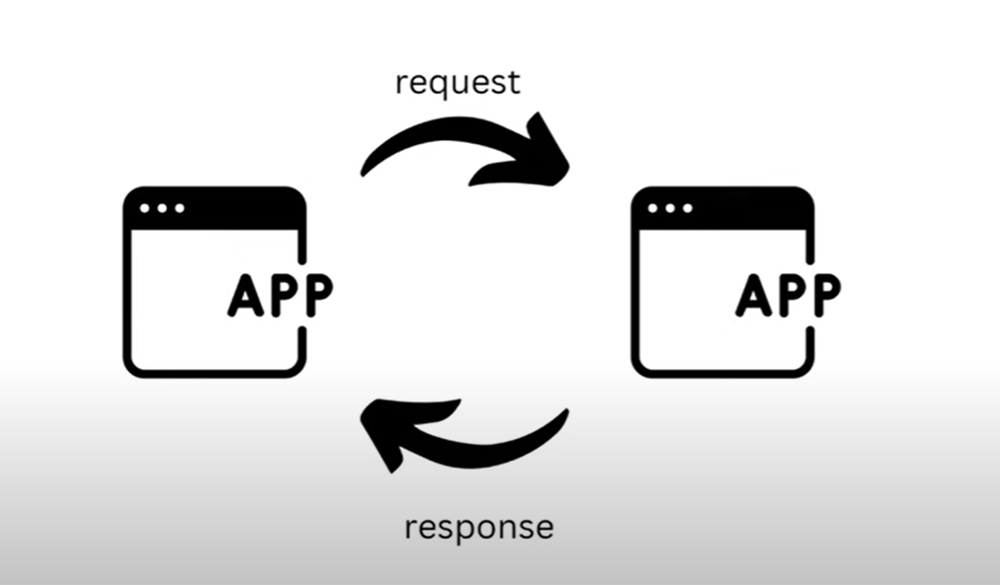
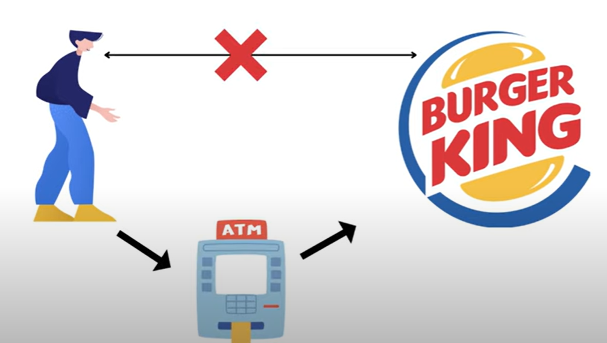
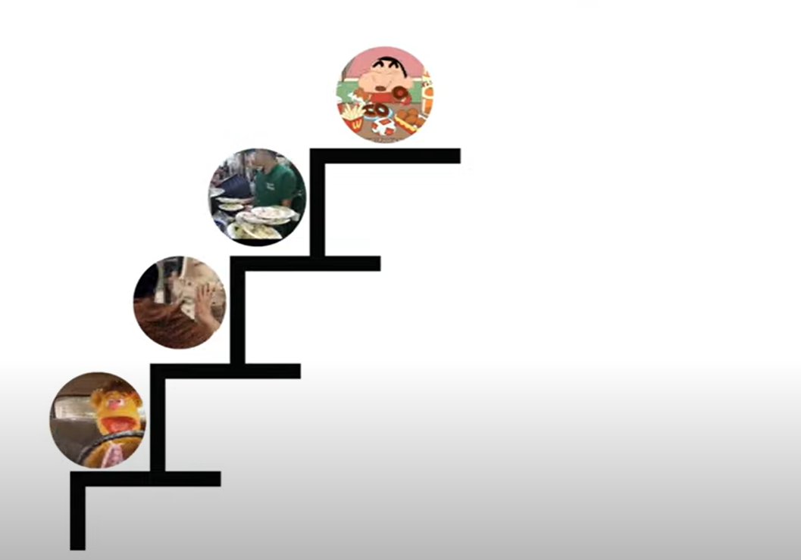
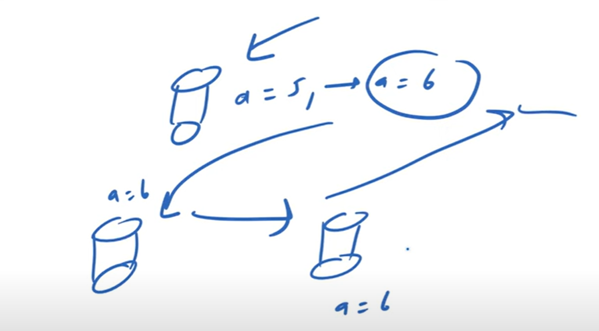

# Synchronous communication (Blocking Calls)

   

    Suppose you do not have money and you went to ATM you have Inserted Card and Entered Pin Now you are waiting to complete processing
    and to withdrawn Cash, so this is a SYNCHRONOUS communication between you and ATM. you will not go anywhere and you will be waiting
    for a Cash and to processing get it done so this is a synchronous communication and this also called a BLOCKING call.
        Now this time you will not do any other work or you will not go anywhere you will be blocked this is a Sysnhronous communication. 
        

   
   
    Suppose we have 2 Apps. one App is sending a REQUEST So, The App who is sending a REQUEST will WAIT for another App till the RESPONSE
    come. Till the Response not come will wait and will not perform any other tasks. 

   
   

    Suppose you have to go to Burger King to Eat Burger But You do not have Money. so first of all you have to go to ATM and then you have
    to go to Burger King to eat burger. so, here step-by-step processing happens. untill you will not go to ATM you will not eat Burger.
    so, here ATM get blocked you so first of all from ATM cash will come then you will go to eat burger.
    

   
   
    Here Things are happening in steps...
    First You will Drive car
    Second You will take cash from ATM
    Third You ordered the food
    Fourth You Eat food
    This is a Sequential Process happening in steps. You can not skip any of the STEPS in mid between so, this is a
    SYNCHRONOUS process. If you missed any single step then you can not eat Burger. 

    Suppose you have a function with 3 statements. 
    In First step data will come from database.
    In Second step we will do some change in the data come from db.
    In Third step either we can return or we can print.
    so, all 3 statements should be executed in a sequential manner.
    

 # Use Cases—When to use Synchronous Communication

    1. To achieve Consistency

    2. transaction

    ** wherever you want to achieve consistency then you have to use synchronous communication.
    ** while doing payments/transaction then you can use synchronous communication.

    
   1. To achieve Consistency

    suppose we have a database and there are 3 replicas. suppose i am changing in one db. to achieve consistency means in all 3 replicas
    data should be get updated. 
    If I will do in Asynchronous manner then there will be one problem occurred our system will not be consistent. 
    suppose a value i changed in one db from 5 to 6. then in between one another person come and read from replica a=5 which is wrong
    becaause system not get updated. 
    I want high consistency so what i have to do is I have to perform this process in a sequential manner which mean immediately.
   
    
    In case of high consistency we apply synchronous communication.
    In case of TRANSACTION also we need high consistency so we apply synchronous communication.

    

 # Industrial Use cases

    1. Stock Market - In Stock Market we need high consistency so we use synchronous communication.

    2. Bank Payments - In Bank Payments we need high consistency so we use synchronous communication.

    3. Ticket Bookings - In Ticket Bookings we need high consistency so we use synchronous communication.

    4. Real Time Decision Making - In real time we are making some decision which mean immediately we need to give response/answer
                                   we can't wait in that case also we use synchronous communication.
    