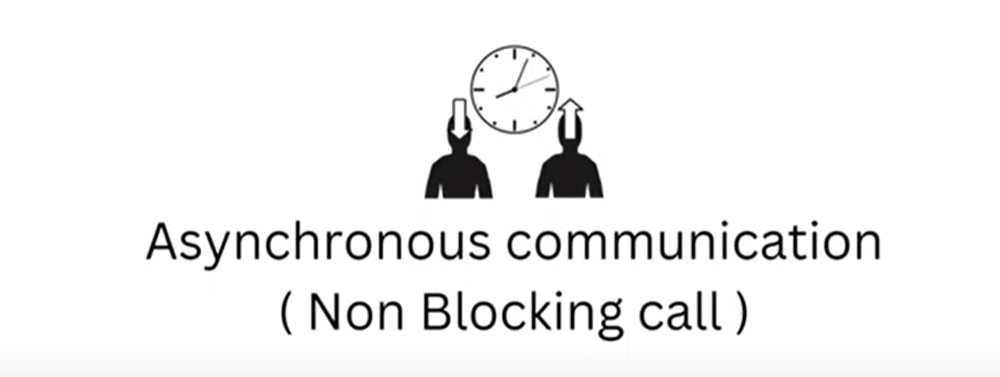
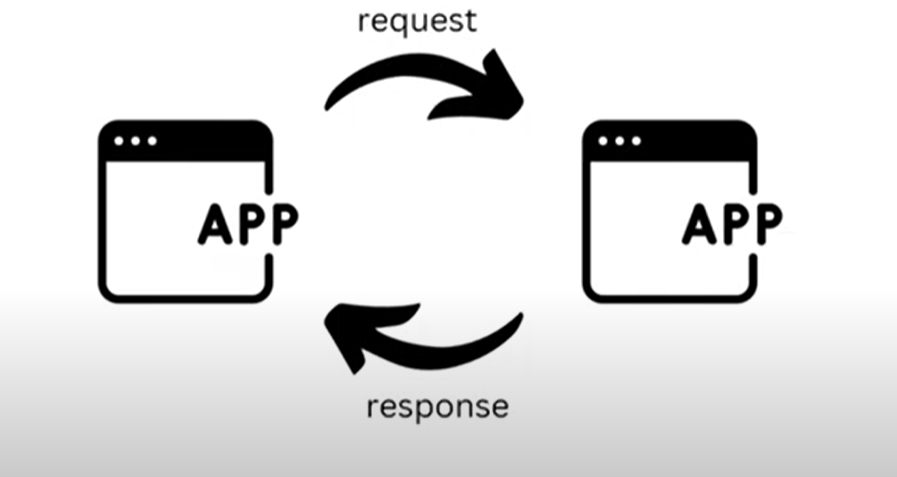

 # Asynchronous Communication (Non- Blocking Calls)
 
   
   
    
   
    
    Suppose there is a person who want to eat a cake, but to bake a cake it might take 3 hours so person said ok i will come after 3 hours.
    person will not wait he is free so he will do some other tasks. so here process is not synchronous. for 3 hours what person will do there. 
    Earlier we saw things were happening in a sequential manner untill you won't get a cash you can't eat burger. here things are not 
    happening in a sequential manner.

    
   

    Earlier we saw we have a function in 
    1st step we fetch data from db
    2nd step we do some data manipulation
    3rd step we prepare response and send back.
    All steps are happening in a sequential manner so all are depending on each other. till db data not fetch we won't do manipulation
    without manipulation we can send response back.
    
    Now suppose before sending a RESPONSE we want to send a notification to user. so 3rd step notification and 4th step sending response
    ** so, now 3rd statement we can make it asynchronous.
    ** 1st, 2nd and 4th statement will be synchronous.

   Because 3rd statement Sending a Notification may take Time and there is no dependency on IT and we do not want
    to happen Immediately. so, NOTIFICATION statement we can keep as an ASYNCHRONOUS.

    
 # Example

   

   # Amazon Cart (Synchronous)

   The Application waits for this response before allowing the user to add the product into the cart.

    we have added few Items in cart so this will perform synchronous because In REAL time we have to check either that item is available or not.
   
   # Payment (Synchronous)

   Application waits till the confirmation of payment has been successfully received from bank.

    while doing payment, we need high consistency so synchronous.

   # Notification (ASynchronous)

   It can take some time for the notification to arrive, but in the mean time a user can do anything
   on the application without waiting for the notification.

    after placing order need to notify user. why simply i should block that user there is no use to wait because
    there is no dependency on it. It's not like after Notification result come then we are going to use that notification result. 
    
    
    
 # Where It is Necessary? 

   1. Computation Takes a lot of Time.

   2. Scalability of Application

   3. Avoid Cascading failure