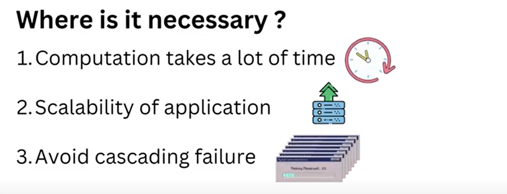

 # Asynchronous Communication (Non- Blocking Calls)
 
   
   
    
   
    
    Suppose there is a person who want to eat a cake, but to bake a cake it might take 3 hours so person said ok i will come after 3 hours.
    person will not wait he is free so he will do some other tasks. so here process is not synchronous. for 3 hours what person will do there. 
    Earlier we saw things were happening in a sequential manner untill you won't get a cash you can't eat burger. here things are not 
    happening in a sequential manner.

    
   

    Earlier we saw we have a function in 
    1st step we fetch data from db
    2nd step we do some data manipulation
    3rd step we prepare response and send back.
    All steps are happening in a sequential manner so all are depending on each other. till db data not fetch we won't do manipulation
    without manipulation we can send response back.
    
    Now suppose before sending a RESPONSE we want to send a notification to user. so 3rd step notification and 4th step sending response
    ** so, now 3rd statement we can make it asynchronous.
    ** 1st, 2nd and 4th statement will be synchronous.

   Because 3rd statement Sending a Notification may take Time and there is no dependency on IT and we do not want
    to happen Immediately. so, NOTIFICATION statement we can keep as an ASYNCHRONOUS.

    
 # Example

   

   # Amazon Cart (Synchronous)

   The Application waits for this response before allowing the user to add the product into the cart.

    we have added few Items in cart so this will perform synchronous because In REAL time we have to check either that item is available or not.
   
   # Payment (Synchronous)

   Application waits till the confirmation of payment has been successfully received from bank.

    while doing payment, we need high consistency so synchronous.

   # Notification (ASynchronous)

   It can take some time for the notification to arrive, but in the mean time a user can do anything
   on the application without waiting for the notification.

    after placing order need to notify user. why simply i should block that user there is no use to wait because
    there is no dependency on it. It's not like after Notification result come then we are going to use that notification result. 
    
    
    
 # Where Is It Necessary? 

   1. Computation Takes a lot of Time.

    when computations takes more time then we make the process as asynchronous as we saw bakery example. 

    suppose you have open a web pages like flipkart.com or google.com it open immediately but processing is going in background
    because that is asynchronous page get loaded immediately but process still under processing which is asynchronous. 
        If we not make this as an asynchronous then manner will be sequential until and unless our all backgroud task not done
        till then we will wait and our web page was getting loading an loading an loading...we will wait for a loag time for a 
        web page to open, in this case user experience will go wrong.

   2. Scalability of Application

    If You want to make your system more scalable then also you have to use asynchronous communication. 

    for an example there is a function with 4 line...1st line fetch data from db, 2nd manupulation on code, 3rd sending a notification
    and 4th sending a response back. so for all user all 4 line of code will run...but the 3rd line will take more time to respond
    and since there is no dependencies on it so we can make it as an asynchronous call.

    so, what will happen for me all 4 line will run where 3rd line will be running in a background...for the 2nd person also all 4 line
    will get run where 3rd line will be running in background. so what is happening more and more people are able to sending a REQUEST
    if it was synchronous then processing time get will increased.

   3. Avoid Cascading failure

    suppose I am a client and sending a REQUEST to a person 100 request per second but that person are able to send only 10 response per 
    second so in this case that person will be overloaded with a requests so what we can do we will make this communication as a asynchronous.

 
 