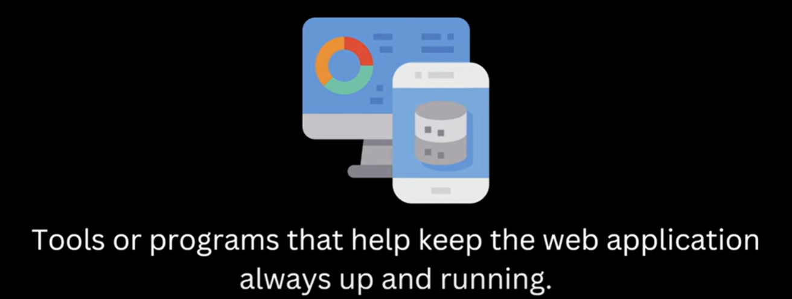
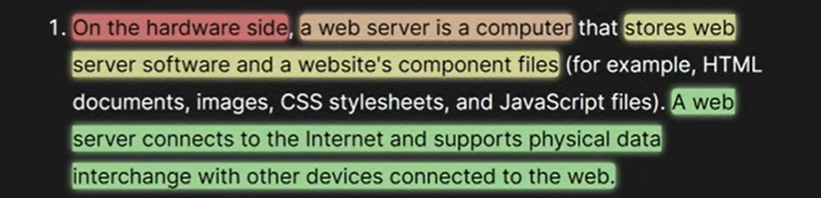
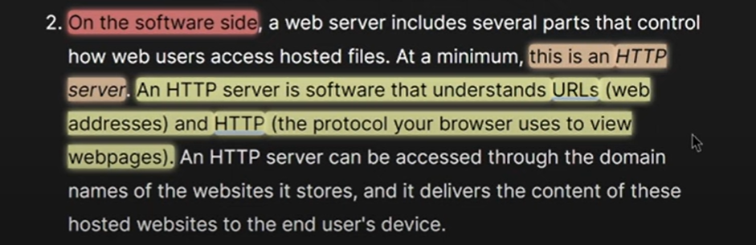
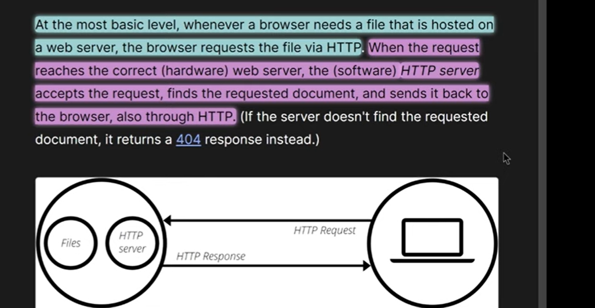
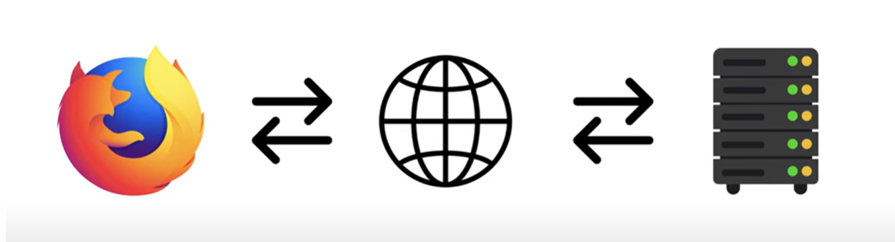
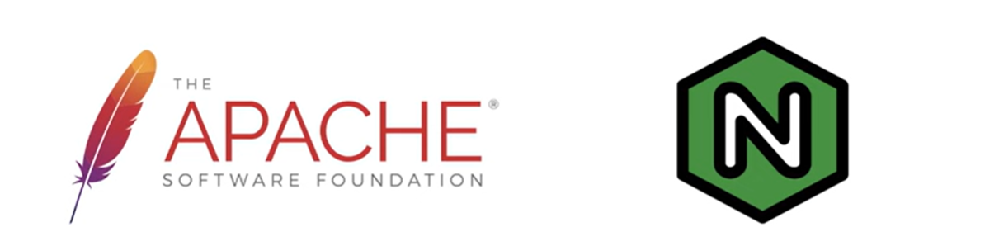

 # Web Server
 
    Tools or Programs that help keep the web applications always up and running. they ensures to always run. 

   

    Suppose In java you have written a code and created a JAR now that JAR should always be running who will ensure, Web Server will ensures.

 # Web Server can be Hardware or Software or Both
    
    Hardwrae is a Web Server/Computer and software is a HTTP Server

   

   

    
 # Example - 

    
   

   

    Browser will send REQUEST over the INTERNET then REQUEST will go to the SERVER and then the RESPONSE will reach to
    Browser over the INTERNET.

 # Web Server Examples -

   

    The Apache server, more formally known as the Apache HTTP Server, is a free, open-source, and widely used web server software. 
    It is developed and maintained by the Apache Software Foundation. 

    Nginx (pronounced "engine-X") is a versatile software that functions as a web server, reverse proxy, load balancer, mail proxy, and HTTP cache. 
    It's known for its high performance, stability, and ability to handle a large number of concurrent connections.

