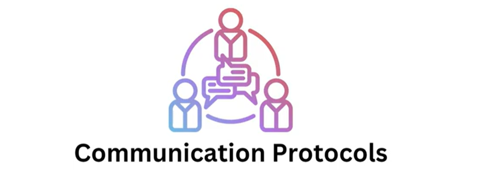
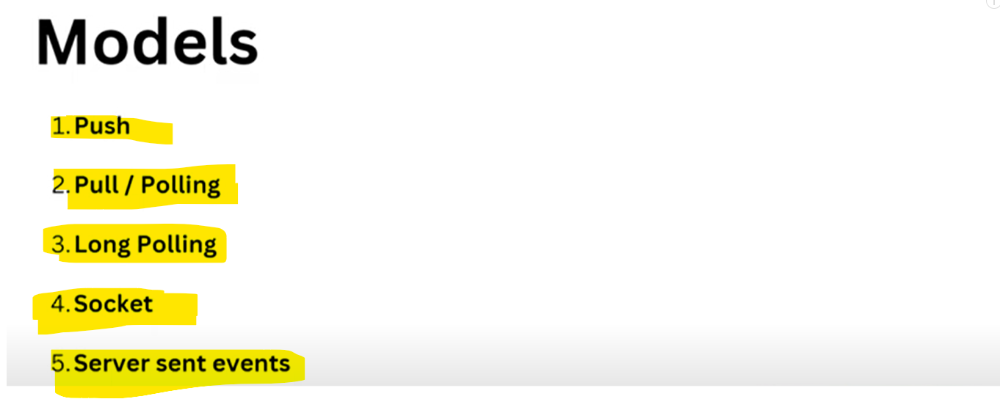
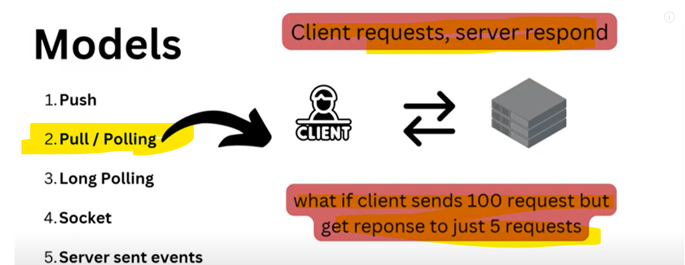
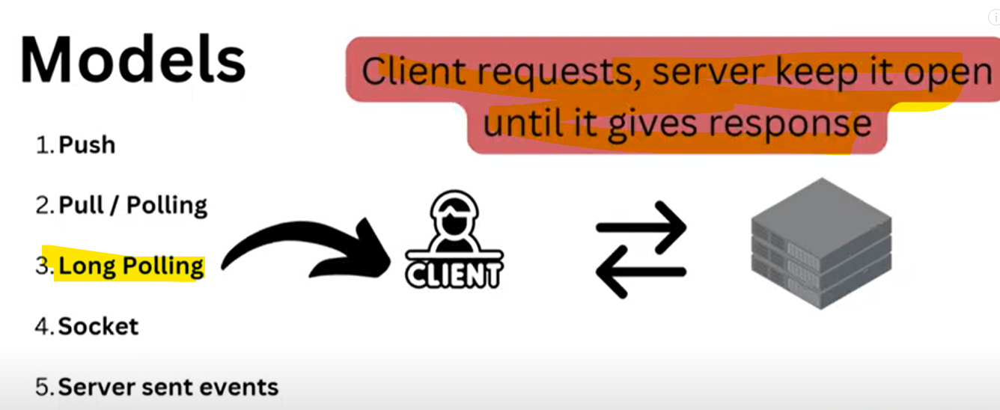
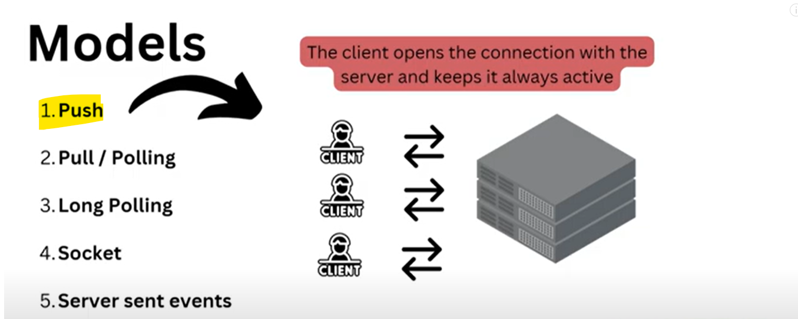
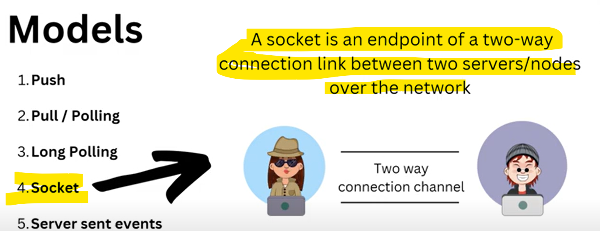
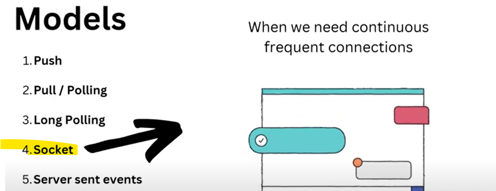
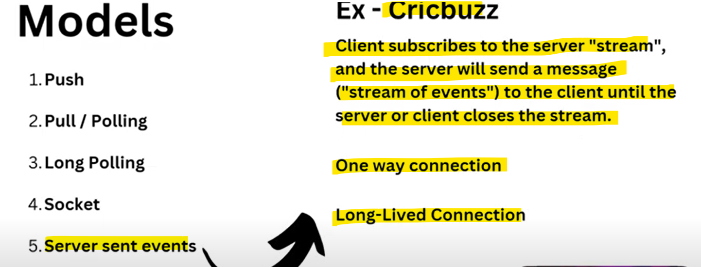
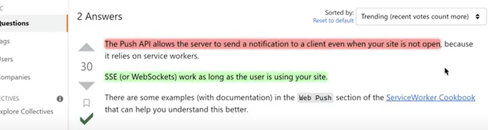

 # What is communication protocol in computer network?
 
   
   
   Communication Protocol means How Client and Server will Communicate with each other.
   
    Theses protocols can be implemented using hardware, software or a combination of both.

 # Communication Protocol can be Implemented in five Ways

   
   
   # Pull / Polling

    Client Requests, Server Respond.
    I went to a Shop and i ask for a choclate he has given, so I asked then he has given this is a pull/polling.
    If I won't ask he won't give.
    If 100 request coming but server responding only for 5 clients then 95 getting failed so there is a problem.
   

   # Long Polling

    We can solve above issue using long polling. 
    Client requests, server keep it open until it gives response.
    I went to a shop and asked chocalate then many people came and asks for then he has noted down in a register when available he will provide.
    disadvantage - ordering issue
    disadvantage - server will be always busy.
   

   # Push

    We can solve above issue using Push communication protocol.
    The Client opens the connection with the server and keeps it always active.
    The server pushes new events to the client. this method reduces the server load.
    In Polling and Long Polling we are sending a REQUESTS and RESPONSES were coming 
    In Push we have given our name and address like when it will be available send me response.
    In Push the problem is when we do not required the response or our requirement fulfilled but later server is still sending a response
    In Push we just subscribed and whenever data will be available server will send the responses. 
    In Push we just open the connection and whenever new data will come server will send the response to the client.
    For example Instagram likes we just open and dynamically in all likes pop up will come and keeep increasing the count value so push notification is coming.
       
    

   # Socket

    When we need continuous frequent connection.
    Earlier In Polling we saw request - response, request-response....
    When any requirements will come to make many connections for example chat application whatsapp, instagram...
    so there frequent communication is happening...so better we can do 
    we can make a two way communication channel.
    we are just creating a channel for request and response.
    A Socket is an endpoint of a two-way connection link between two servers/nodes over the networks.
   
   
    

 # Server sent Events

    Client subscribes to the server "stream" and the server will send a message ("stream of evenets") to the client
    until the server or client closes the stream
    one-way connection
    long-lived connection
    Example - Cricbuzz
   
   

# What is the difference between Push and Server sent events

   
   
    Cricbuzz will send an updates or event only when their websites are opened.

 # Polling, Long Polling and Sockets—Two way connection

 # Push and Server sent events—One way connection