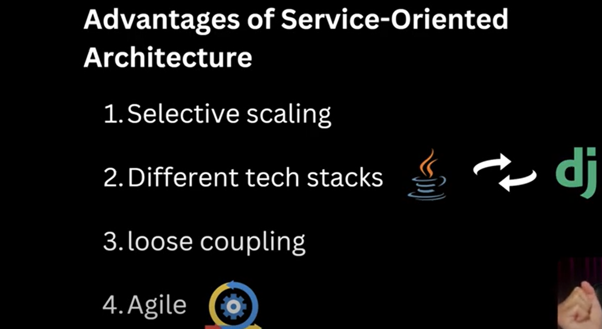

 # REST API | SOA | Microservices architecture | Tier architecture
 
   
   

 # difference between Web application and Website

    Website is a static so website content won't change example blogging website only i am posting everyone is just viewing.
        
    Web Application is interactive like facebook everyone is changing

 # REST (Representational State Transfer)

 
 
 
 
 
 
 
 
 
 
 
 
 
 
 
 
 
 
 
 
 
 # SOA (Service Oriented Architecture)

    SOA mean A Big Application divided into a smal small parts or modules. or break into a small-small modules.

 

 

 
 # Advantages of Service-Oriented Architecture (SOA)

 1. Selective Scaling

    suppose we are having a Monolithic application so everything in a single JAR and that JAR got deployed.

    Can we scale monolithic application yes, we can, but through Redundancy

    But suppose in our monolithic application we have 1500 APIs, but most used is only 1 API, so should we do redundant
    of all 1500 APIs. suppose we have a single JAR, and we have a single machine now, and we want redundancy so same JAR
    we need to deploy on 4 systems. so this is resource wasting only. so In SOA we can do selective scaling because that API
    which was mostly used, I have created a separate JAR for it and this JAR i can scaled it rest 1499 api jar i will put on
    a different server because not getting more used.

 2. Different Tech stacks

    one service is in zango, another is in java does not matter because communication with each other will happen in JSON
    responses will come in JSON.

 3. Loose Coupling

    All services are independent with each other

 4. Agile

    agile we can follow different-different component can be developed by different-different teams. 

  

# Disadvantages of Service-Oriented Architecture (SOA)

1. Higher Latency
    
    In monolithic all codebases in a single application so process-to-process calls happened but here network calls happen so
    we know network calls are time-consuming. 

2. Complex to secure

    since multiple machines to security handling will be a complex part.
   
3. Cascading failures

    If one service gets failed, there might be a chance other dependent service also get failed. 

4. Complex understanding

   

 # Microservices architecture

   SOA advanced version is Microservices architecture.
   
   Here we do more loose coupling.

   Microservices architecture is an evolved version of SOA that promotes software components to be loosely coupled.
   
   It is the most granulated type of architecture design, and every service is completely independent of the other.
   
   In SOA some dependencies are there but in microservices all services are independent with each other.
   
   If we have 10 services then in SOA 2-2-2-2-2 we will deploy on 5 servers but in microservices total 10 jars
   will create and deploy on 10 different servers.
   
   

# Tier architecture

   Tier 1 - within a same machine front end-backend-database will be deployed.
   
   Tier 2 - front end in a differnt system and backend and database in a different system
   
   Tier 3 - all 3 separated and deployed in a different machines
   

   
   
   
   
   
   

   
