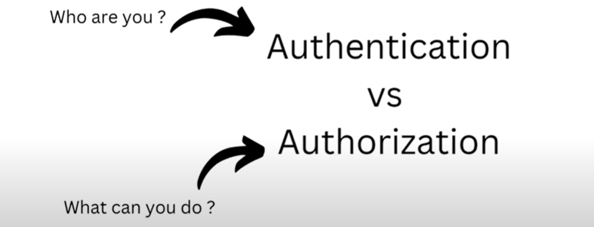

# Difference between Authentication and Authorization 

   Authentication: Who are you?
   
   Authorization: What can you do?
   
 
 
Authentication-    
    
    suppose you are trying to login on some application with credential for a proof you are that authenticated person
    who is having valid credentials. this is called authentication.

Authorization-

    suppose you have loggedIn in any application. suppose in a company you joined newly they have assigned you ip address and port
    suppose in database server you logged in and see all tables. now what i can do can i delete any tables, can i alter any tables,
    can i insert some data, can i update some records or only we can view the table's data. 
        what all are the rights i am having?
        what i am authorized to do?
    My manager said you are not authorized to delete, update, insert and alter... this is called AUTHORIZATION.

 AUTHENTICATION means you are the same person who claimed for?????????

    

    