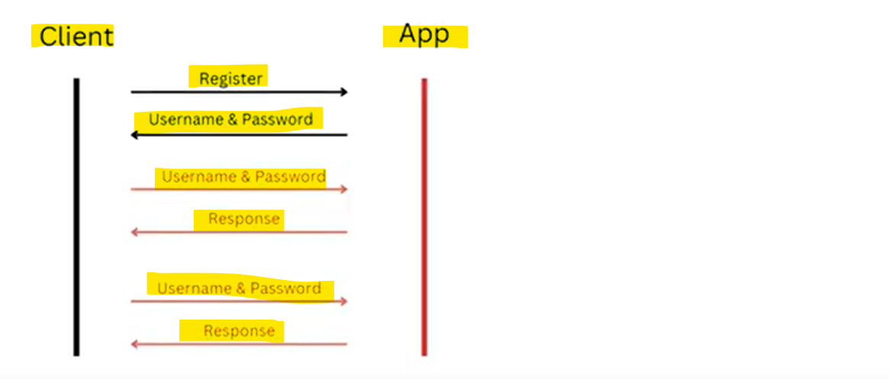

# Basic Authentication

    First of all Client will get Register and App will give user name and password.

    Now on Every Request when client want to access application he is going to use username/password.

    This is a Basic Authentication and we can put this username/password in Headers.

    This is the most basic authentication version.

    Disadvantage - On every REQUEST in a clear TEXT username/password is going.

    

    

