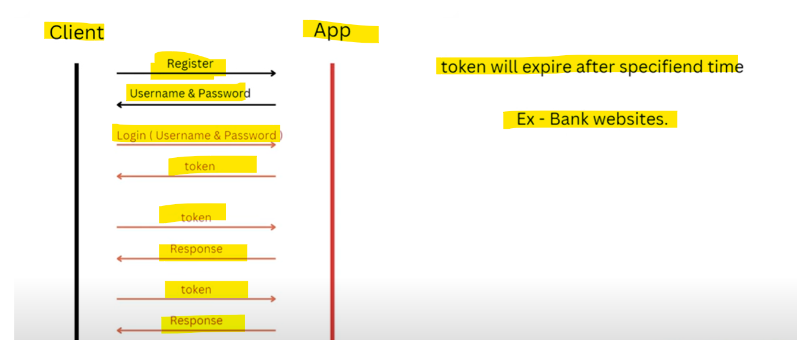

 # Token-Based Authentication
 
    In this Client will get Registerd first.
    
    He will get Username and Password.

    Then Client is going to do Login with same username and password.

    Then A TOKEN will get Assigned to a Client.

    Now on Every REQUEST client is going to send that TOKEN.

    Now on every REQUEST no need to send username/password in HEADER we will use TOKEN instead.

    That TOKEN will get EXPIRED in some specified amount of time.

    Example - Bank Websites.

    When you loggedin in Bank websites they provide one TOKEN and that TOKEN will get expired in some time
    when you will not using Bank Website for some time it automatically logged out why because the reason
    is our TOKEN got EXPIRED.

   