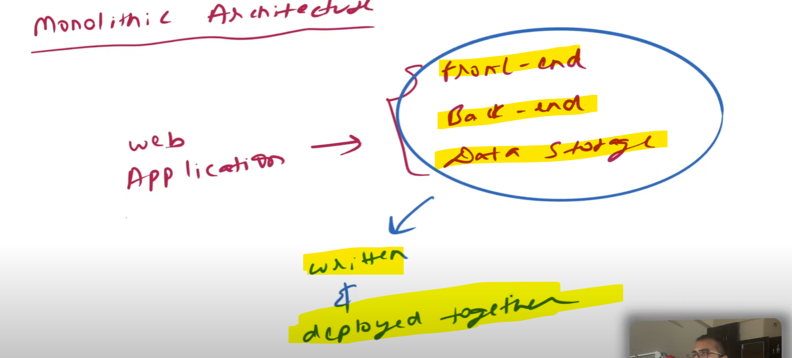

# Architecture

    Internal design details for building the applicatios.

    Which means If You are going to building an application then how are you going to build it and what would be the Internal design
    that is called architecture. 

    Suppose i want to develop one Web application so, before building that application first i will consider how i can design bcz there
    will be some components of that application so how i can design that components. so, that process is called architecture.  

    Basically Before creating an application first i will think what would be the architecture of this system. 
    so, trivialest(mamuli) architecture is Monolithic architecture. when we start developing application from scratch then first of all
    we think about Monolithic architecture. 

# Monolithic Architecture

    we are going to create a monolithic architecture of a Web Application.

    All Web applications like Fcaebook, LinkedIn or Google having 3 components-
        1. Front - End
        2. Back - End
        3. data Storage.

    Monolithic architecture is an architecture where Front-end, Back-end and Data Storage all has combined together
    and also deployed together. which means an application which contains all 3 componets together which mean written
    in a same code-base, in a same repository and also deployed in a same place or same server. then we can say this 
    application has been written inside a Monolitic architecture. as the name suggested Mono-> single/one.

    If all the components and functionalities of a project are entangled and combined in a single code-base, then
    that is a Monolithic Application.

    Monolithic architecture has less Complexity => Easier to understand + Higher productivity.

    Monolithic system is also known as Centralized ssytem, because everything are together at one place or 1 repo.

    
# Advantage-When It is good

    1. When we are just starting.

    2. In monolithic architecture , all the modules are present in the single system, so, they require fewer network
       calls as compared to other architectures.

    3. It is comparatively easier to secure monolithic ststem. - bcz all modules are not on a distributed server.

    4. Integration testing is easier.  - bcz all modules are not on a distributed server.

    5. Less confusion.

# Disadvantages of Monolithic architecture

    1. In Monolithic architecture, every module is combined in a single system, so, if there is an error or bug
       in a single module, It can destroy the complete system.
            If one module will break in that case whole application got break.

    2. In Monolithic architecture,whenever a single module is updated, the whole system needs to be updated to
       reflect the changes to the users. All modules are present in a single system and are connected to one 
       another, so, the whole system needs to be updated.
            If a single module get updated the whole application need to re-deploy.

    3. In Monolithic architecture, If there is any change in a single module's, programming language or framework,
       it will affect the entire system. The entire system needs to be changed because every module is interlinked
       and tightly coupled.
            If we want to change one module language then for that every module we need to change because there 
            might be a chance to occurred compatibility issue.
    
    4. In Monolithic architecture, If we did a small change we need to build a jar of whole application and need 
       to deploy on server.

# What is difference between Webside and Web-Applications?

    Website means we are having static - contents which means READ only.
    example- blogging website, i am writing my contents and user are just viewing it they can't update.
             
    Web application means we can view and write both. READ & WRITE both.
    example- LinkedIn, Instagram & Snapchat these all are a web applications. bcause we can see post or 
             blogs and we can write also our thought or blogs.

# If It's a READ only then Website
# If it's a READ plus WRITE then Web Application.

