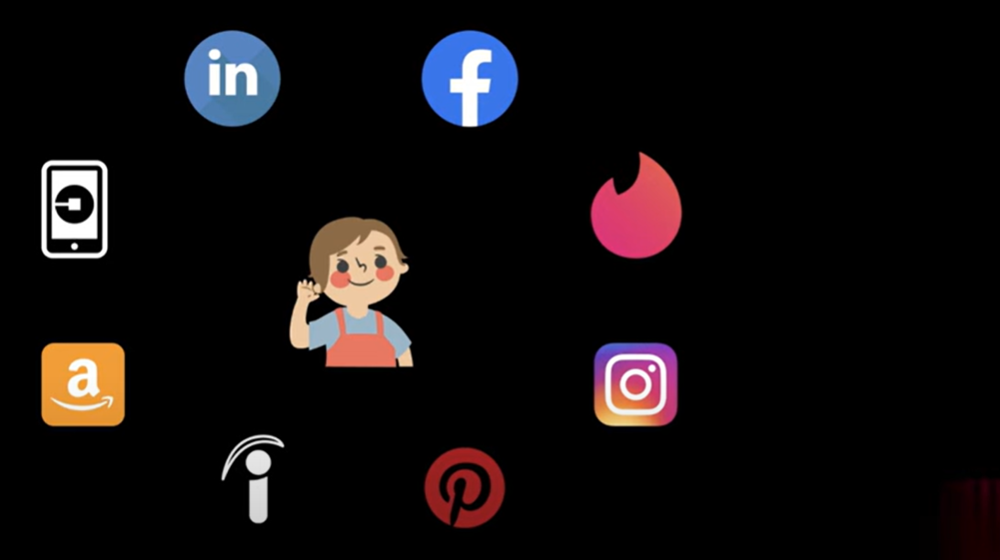

# OAuth Authentication

   In the REAL world, we are having many applications.  

    
  
   Now What you have to do is every website username and password you must have to REMEMBER, so this is a PROBLEM.

   One more PROBLEM suppose there is one new APPLICATION came tomorrow and a PERSON wants to do SIGN_UP but there 
   are a lots of fields and details to be ENTERED but now PERSON does not want to SIGNUP_UP again and fill all these
   details so, PERSON just wants to CLICK a BUTTON and get SIGNED_UP so now there is 2 PROBLEMS

    1. Many Applications are there and need to remember all Username and Password.

    2. Now second PROBLEM is who is app provider/app developer/app creator facing problem to
       getting sign up from new user because a lots of details need to filled in a FORM and 
       PEOPLES do not wants to filled up. 

   

    Now If you want to create an ACCOUNT on INSTAGRAM or LINKEDIN then you CLICK SIGN UP
    WITH GOOGLE, on a single CLICK you allowing to provide all user details to INSTAGRAM.
    you just CLICK and ALLOWED and SIGN UP get done. your PASSWORD will get SECURED so, this
    is OAUTH. now with the help of OAUTH it will be easy for a USER to do SIGN UP and also
    no need to REMEMBER for a different - different username and password. you also have seen
    some websites get login through github or linkedin. 
    
    
   
   