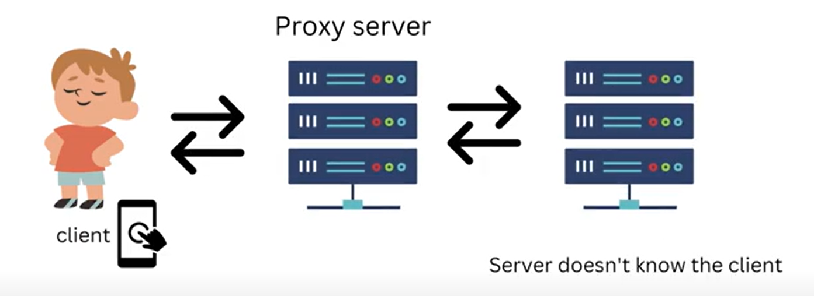

 # Forward proxy and reverse proxy
 
   
   
    suppose there is a class and there are some STUDENTS and current time is for ATTENDANCE
    Shyam is ABSENT but Ram has taken his ATTENCE. so, here Ram is acting as PROXY.
    Ram is acting as proxy of Shyam.

    A Proxy Server is a Hardware or a piece of Software that is placed between a client and
    an application to provide intermediary services in the communication.

    A proxy always placed in between Client and Server.

    The Proxy Server provides a gateway between the user and the internet.

    2 Types - 

        1. Forward Proxy

        2. Reverse Proxy

   1. Forward Proxy 

       

        I have opened an Application in my phone that REQUEST went to a SERVER and then
        the SERVER has sent a RESPONSE.
    
        This Time there is a Direct Connection Client knows who is server and Server knows
        who is Client.
        
        If we placed Proxy Server In Between this time my application is hitting Proxy Server
        and Proxy Server is hitting Actual Server.

   

   ** The Actual Server do not know who is the Client this time. this is a Forward Proxy.

   ** Forward Proxy hides the Identity of a Clients.

   ** The Actual Server do not know who is the Client what is his Identity The Actual Server assume
      Requests are coming from Proxy Server.

 # Example -

    There are many websites which is blocked in india.

   

    you have opened this website and response is showing this website is blocked.

    Then I am writing Proxy of this website 

    When I googled proxy of this websites 10 to 15 websites link came when i clicked any of proxy websites it opened
    then How it opened? 

    Suppose Actual website name is xyz.com, so when i entered xyz.com then server already knows this user from India
    so he has responded ACCESS DENIED. now i typed in google proxy of xyz.com then multiple link came i clicked any of 
    link then website get opened and showing access granted now it accessible. 

   

    Now This time Actual Server has no Idea i am accessing from India.

    I have open the Proxy and then Proxy has sent a Request to actual website so, In this case Actual Server is assuming 
    this Request is coming from somewhere else he assume Request is coming from Proxy server. 

   ** The Actual Server Does Not Know Who is Actually Requesting.

    

             

    

    