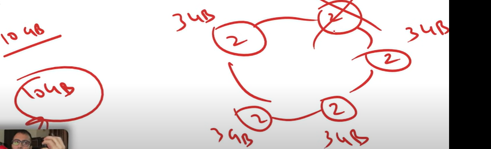
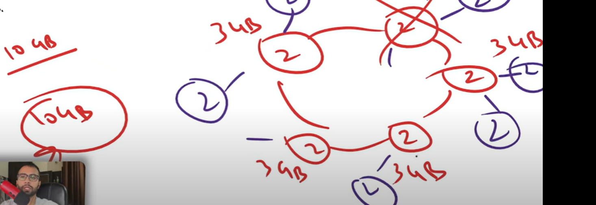
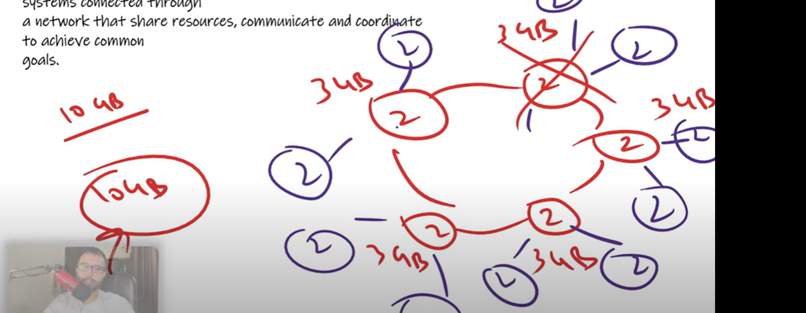
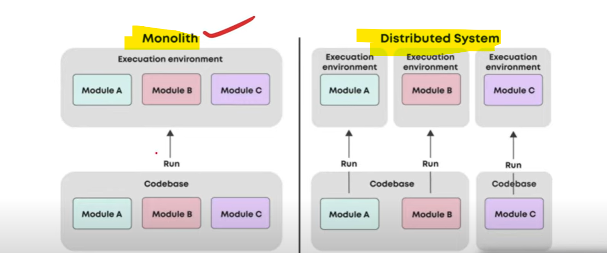

# What is Distributed System ?

    In monolithic all our modules resides in one code-base and while deploying deployed in a one place.
    
    But In distributed system code base also in a different repo and where they execute or deployed that is also 

    on a different machines.

    A distributed system is a collecton of multiple individual systems, connected through a network that share
    resources, communicate and coordinate to achieve common goals. 

    
    suppose we have 10GB database, in a centralized system we kept all 10gb data together. In case of distributed
    suppose we have 5 taken machines of 3-3 gb each and kept 2 gb data within it and obviously all database will
    be connected with each other. so we have distributed 10 gb to 2-2 gb each machine rely on different servers.
    
        so, here we can achieve single point of failure. suppose If one machine down then other machine will work.
        suppose if one machine will get down then their data got loss?? then how we can bring data back so, in distributed
        system also having one issue- Data Loss. 
    
        If one machine not work then data will get loss so for that Replication comes in. 
        REPLICATION - for each machines there is a Copy. replica we can take any number of
                      machines we can 2 or 3 or 4 machines. 
  

  

        Here Replication factor is 3, which mean which mean for one data there will be 3 copies availables.
        so, suppose if one machine not work then control will move to their replica. 
   
    

# Difference Between Monolithic & Distributed system.

    Monolithic architecture we can't scaled it and was a single point of failure. 

    SPOF (single point of failure) - If one module break then entire system break.

# Advantages of Distributed Systems

    1. Scalable - we can scale it Horizontaly. Horizontaly scalable we can add more 
                  machines to improve it's capability. if one work is doing by 1 machine then
                  that work i will divide to 2 parts and give it to 2 machines. so it's scalable.

    2. No SPOF - no single point of failure we already saw.

    3. Low Latency - our system is distributed and we can keep our server anywhere. In case of centralized
                     system server will be available at one and only one place and that will increase latency.

# Disadvantages of Distributed Systems    

    1. Complex - because we have added multiple servers / nodes.

    2. Management Required - It requires additional managements like Load Balamcing.
                             like how we are going to distribute network calls in between the servers. 
    
    3. Difficult to Secure - In our centralize system we are having only one code base so to secure that it's easy.
                             but here we are having multiple nodes(servers) so each nodes we need to secure differently.
                             so, that is require additional time, additional resources and additional knowledge.

    4. Msg may be lost in between nodes 

# ADV - DS is Scalable and not Single Point of Failures.
# DIS-ADV - Earlier we saw one disadvantage was data loss but we achieve using Replication.