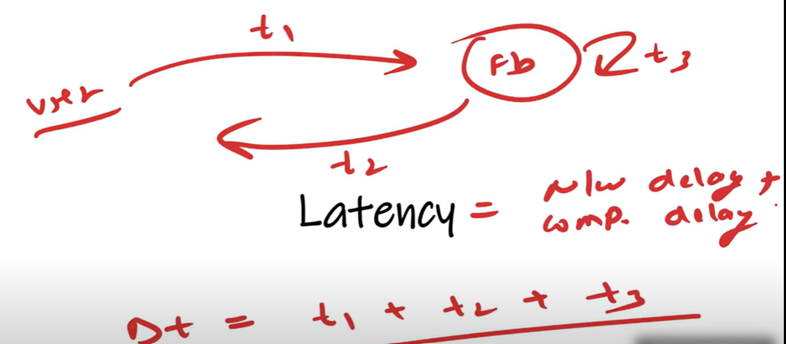
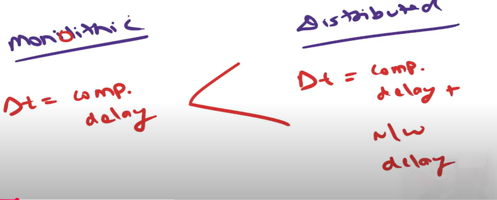
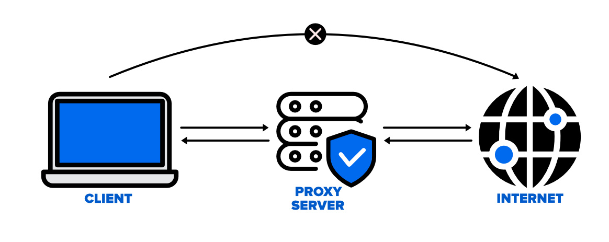

# Latency
-----------
    let's see what is the meaning of Latency in Web applications. 

    suppose If i write facebook.com then that request will go to Facebook Server and from there response came,
    How much time it took in this round-trip called Latency.

    suppose for request goes took T1, for Response come back took T2 and for Computations took T3 

    Latency(Delta Symbol) - T1 + T2 + t3.

    Latency = Network delay + Computational Delay.

   

    
# Latency Varies Between Monolithic Vs Distributed System
----------------------------------------------------------

    In Monolithic there will be no network delayed because all components deployed together, so there will be no network delayed.

    So, In case of
    
    Monolithic Latency = Only Computational Delay

                          Initial and Final netwok calls only applicable in case of monolithic. when we write facebook.com
                          that call will go to server but in between what network call happen that will not happened in case
                          of monolithic. because all code base deployed together.
                                In Monolithic Process to Process call happen. 
                          

    Distributed Latency = In case of DS Network Delayed = Computational Delayed.
                          
                          Because In web application we will have multiple modules and deployed on a differnt servers. 
                          so, the network calls will add on in case of distributed. 

    

   
   

# How to reduce Latency?
--------------------------

    Obviously If latency will be more then user experiance will go down. so 1st way is caching.

   # 1. Caching 

        suppose there is a user sending a REQUEST, so REQ will go to the server and from server RESPOSE will come
        so, it take more time. so, we will add a caching layer in mid between. so, in that case Req will not go to
        server and from Caching itself Response will come, so time will got save. so, first way to reduce latency is 
        caching.

   # 2. CDN (Content Delivery Network)
        
        we can use CDN(content-delivery-network). suppose there is some static data which we want. so, some static data
        we want to bring from serevr so, we can use CDN (content-delivery-network). suppose in US we are having one server
        and from there data will come. so from india to go to US will take time, so what we can do is In our near by location
        In CDN server we will store the data and whenever i will send a REQ then you just sent it back as a RESPONSE.
        so, this is CDN(content-delivery-network).

# What is the Difference Between Caching & CDN?
-----------------------------------------------

        CDNs (content-delivery-network) are geographically distributed networks of proxy servers (like in us we have a server 
        and there is a static content then we have putted in india of CDN) and their objective is to serve content to users
        more quickly. 

        Caching is the process of storing information for a set period of time on a computer. which mean I can set a caching 
        on a server. suppose i have written fb.com, and i am sending REQ to fb server, CDN we can set Geographically anywhere
        near by but caching means on which server i am sending a REQ suppose on fb main server there only i can set caching one
        layer.

        suppose there is a function of 1000 lines, suppose after executing 1000 lines he return result X after calculating 1000
        of lines and in function passing user id. so every time a user is sending an id 1000 kine executing and everytime returing X
        suppose i am putting instagram/myUserid everytime so same response have to everytime and no need to execute 1000 line of code.
        
   
    
        so what i will do in this case i will define a caching key and corresponding of that key i will save a valu of X.
        and from 1st line itself i will send the response once key matched so no need to execute 1000 lines of codes in this case.
   
        

 CDN is Geographically located Caching means on which computer you are working or on which computer your server deployed 
 there itself caching defined. 

How Does The Proxy Server Operates?
------------------------------------

Every computer has its unique IP address which it uses to communicate with another node. Similarly, the proxy server has its 
IP address that your computer knows. When a web request is sent, your request goes to the proxy server first. The Proxy sends 
a request on your behalf to the internet and then collect the data and make it available to you. A proxy can change your IP
address So, the webserver will be unable to fetch your location in the world. It protects data from getting hacked too. 
Moreover, it can block some web pages also.

Advantages of Proxy Server
---------------------------

Security: Proxy Server provides security between internet and system. They help your system from unauthorized user to access your network

Saves Bandwidth: A proxy server can save bandwidth, especially in those environments where the same resources are accessed by multiple users.

Performance: Proxy server improves performance, when a person requests for a resource, then the proxy can serve it from its cache rather than fetching it from the original server this helps to increase performance.

Filteration: Proxy servers are used to filter content based on keywords or file types.

Access Control: There are some content which is restricted in various countries, so proxy server helps to control geographical access.

Disadvantages of Proxy Server
-----------------------------------
Proxy Server Risks: Free installation does not invest much in backend hardware or encryption. It will result in performance 
issues and potential data security issues. If you install a "free" proxy server, treat very carefully, some of those might 
steal your credit card numbers.

Browsing history log: The proxy server stores your original IP address and web request information is possibly unencrypted 
form and saved locally. Always check if your proxy server logs and saves that data – and what kind of retention or law 
enforcement cooperation policies they follow while saving data.

No encryption: No encryption means you are sending your requests as plain text. Anyone will be able to pull usernames 
and passwords and account information easily. Keep a check that proxy provides full encryption whenever you use it.
        