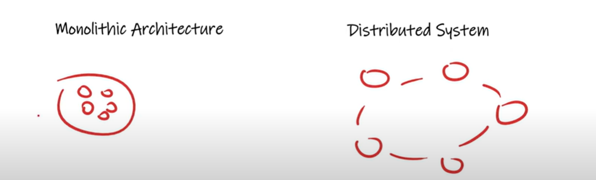
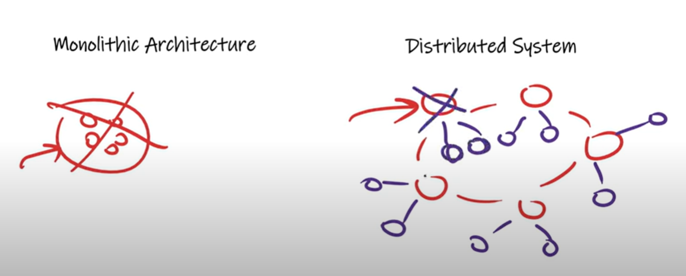

# Availability

    suppose today CBSE results is coming so, there is a website so what will happen on which day results is coming many of the
    peoples sends a Requests to check their results. so,you have seen their websites will go down so their websites not available for that time
    which mean on that period of time this website won't be available. 

    which mean CBSE website availability is too low. so it is very Important while you are developing any web application to improve
    their availability. to make sure on every situations that should be available for a better user experiance. 

    For example for a google there is a very high availability so every time it available does not matter any number of requests can come.
    

   # Monolithic Architecture
        In Monolithic all modules has been deployed in a single system.
        In case of monolithic architecture if our server goes down. If server goes down whcih mean on which server application has
        deployed if that itself goes down then the entire system goes down. all modules goes down because all modules 

        Even we can do scaling of Monolitic as well we can scale it horizontally. so same code-base i deploy on machine 2
        & machine 3. In this case also we can horizontally scaled it but the problem is If any one system goes down then all 
        the modules goes down so less availability. so on other 2 machines get more workload.
            In distributed system there will be a single module on 1 machine. so, suppose if there is no replication and machine also
            goes down then rest other modules will be up only right. 
        So, we can say In Monolithic availability will be less because of single point of failure(SPOF).
        which mean Fault tolerance is directly propotional to Availability.

   # Distributed System
        In Distributed system all modules are deployed in a different systems and they are interconnected.
        In distributed system suppose one serevr goes down then other servers will be available at least. 
        In distributed system we can do replication of a module, we know in DS each modules having a replica. if one server goes
        down then control will move it to any of 2 replicas.
        In Distributed system availability will be more compare to monolithic architecture.

   

   

  # which mean Fault tolerance is directly propotional to Availability.

     If Fault Tolerance will be more or If our machine is fault tolerance then it will be available more.
     
     Like we were creating a replica in case of distributed system which mean in ds  fault tolerance will be
     more which mean will be available more.

     
 # How to Increase Availability?

   1. Do Replication 
            
         Just do replication. we can do replication for everything. like router replication, server replication 
         or power sources replication, we can do. like if light go away second power source will come. 

   2. Distributed system

         Instead of monolithic use distributed system.

   3. Redundancy
            
         Till now we were using replication & redundancy interchangeably, but there is some difference between the
         Replication and Redundancy.

  ** Replication is Nothing But Redundancy plus Synchronization.   

 # Difference between Replication and Redundancy

   Replication Includes redundancy but involves the copying of data from one node to another or the synchronization 
   of state between nodes.
   Replication is a type of Redundancy, but there will be synchronization among them, which means each node synchronized
   with each other in case of replication. 

   Redundancy is the duplication of nodes in case of some of them are failing. 
   suppose one component has deployed on a server, so what i can do is same component i will deploy 
   on a different server. so, this is a duplication of node process. 

   Suppose If we have a microservice then we will do redundancy there but If we have a ase Server then we will do replication there
   because they should synchronize with each other. 
   
   If you want to Increase Availability then go for Distributed System and use Redundancy, or you can use Replication. 
   
 Replication is Nothing But Redundancy plus Synchronization.