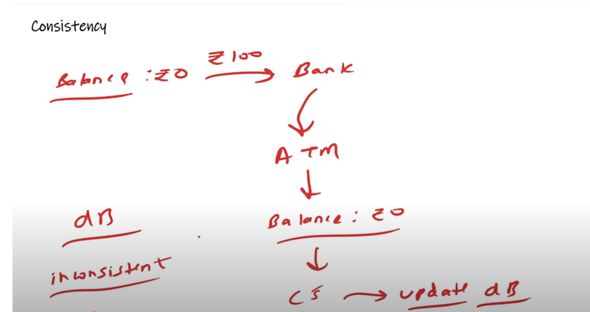
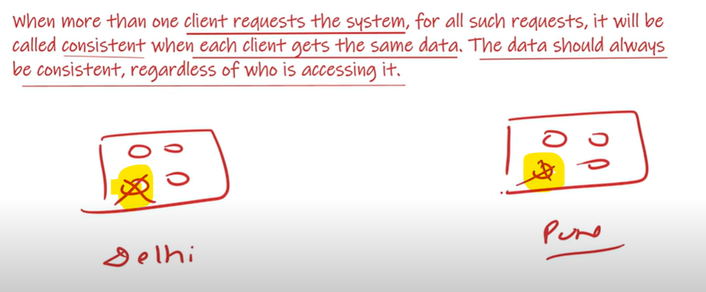
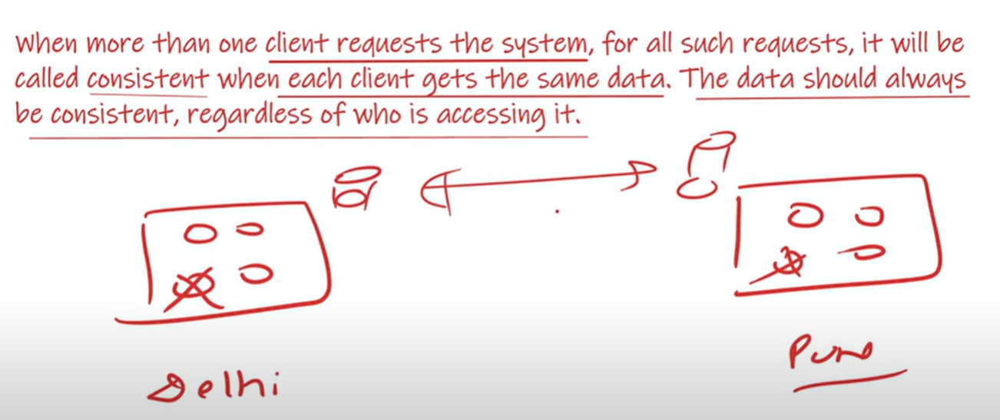

 Consistency 
===============

    Suppose at this time in your account balance is 0. I deposited Rs. 100. after some time i need mony so i want to ATM and 
    trying to withdraw Rs. 100, but In ATM showing balance is 0. so, I call to customer-care said our database is not yet updated.
    once it get updated then only you can withdrawn. which means this bank database is not consistent it is inconsistent.

   

   
 # Consistent

    when more than one client requests the system, for all such requests it will be called consistent when each client
    gets the same data. The data should always be consistent, regardless of who is accessing it.

    suppose I am trying to book movie ticket and there are only 4 seats available and I am in delhi and there is one more person
    who is in pune. there is some decentralization In delhi person accessing through delhi server and from pune guy accessing from
    pune server. 
   
    
    delhi and pune person has booked same seat. so teher is a data inconsistency because as soon as delhi person has booked the ticket 
    so, immediately it should also reflect on a pune server because both are a decentralized server and having different database server 
    so it takes times to get sync. so, there is some inconsistency between them. 
   

 # InConsistent

    when more than one client requests the system, for all such requests, when different clients get different responses 
    due to some recent update that has not been committed to all systems yet, this reading operation will be called 
    dirty read.

    So, delhi guy has committed and pune guy is not reading updated data this is called dirty read, which means wrong
    data it is reading.

    
    

# Consistency comparison between a Monolithic vs. Distributed system

   # Monolithic
        Every things(components) is in a single system. 
        
        suppose this is purely centralized and there is no horizontally scaling and there is only one serevr and our codebase are on that server.
        so here no need to take extra steps this is natively consistent. 
        
    
    
   # Distributed
        The components are distributed here and over the network calls happen.
        
        but here servers are distributed so, one person will access from this server and another person accessing from different servers.
        
        suppose one person has updated one server so it will take time to reflect updated values from other 2 servers. 

        suppose for server 1 it will take time to updated value t1 and for server 2 it will take t2.

        so, Max ( t1, t2 )   =   t - max  , which mean for t-max time our whole system will be inconsistent. so,

        How we can make it consistent.

 # Factors Improving Consistent
   ----------------------------

   1. Improving Network Bandwidth

            Increase the Network Speed, so after increasing the speed synchronization will happen in an earliest.

   2. Stop the Read
        
            Stop the Read operation untill all severs not get updated. like a goverment websites when they are updating systems
            they make it down their websites. 

   3. Replication based on distance-aware strategies 
    
            which mean we should know if server are near by each other then in synchronization we can get a help.
            so, while we are doing replication of serevrs we can keep near by itself.  

 # Types of Consistency
  ----------------------

   1. Strong Consistency

          The system doesn't allow READ operation untill all the nodes with replicated data are updated.
          which mean untill all replicas not get updated all the data not get synced we can stop the READ operation. 
          In Strong Consistency always read a correct data there will be no dirty read.

   2. Eventual Consistency
          
          User Read Requests are not halted till all the replicas are updated rather the update process is eventual.
          some users might recieve old data but eventually all the data is updated to the latest data.
        
          As we were stopping the READ requests in string consistency untill all the servers not get updated In eventual
          consistency we won't do like that here we allowed the READ operations, actually what will happen in eventual consistency
          is slowly slowly all the server automatically become consistent.
    
   3. Weak Consistency

          In Weak Consistency it's not manadatory that all the serevrs/nodes should be updated. 
          suppose if we have 3 nodes it's not manadatory that all the 3 nodes should be in a synchronization. 
     

   *****************************************************************

    Its depends on Business Logics that which consistent strategies 
    you are going to select.
    
    >> In Train Ticket should be Strong Consistent.

    >> Any Social Media, If your friends posts not coming immediately
       then no need to worries. but If same ticket is booked by 2 persons
       then need to worried. 

   ******************************************************************