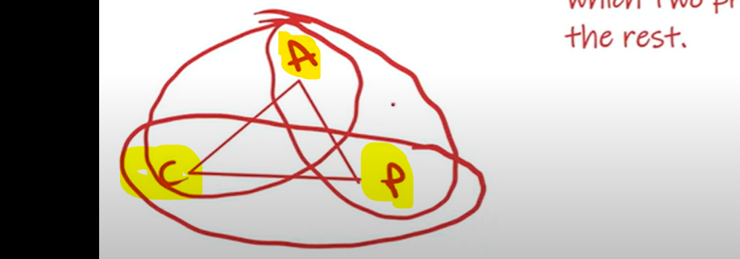
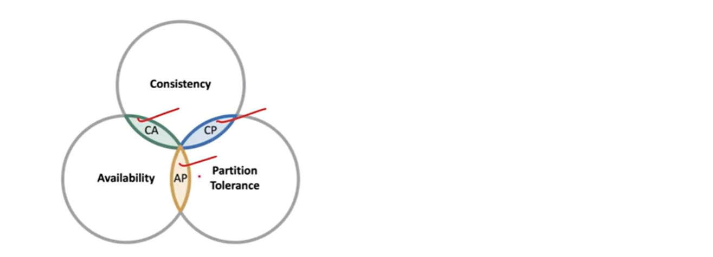
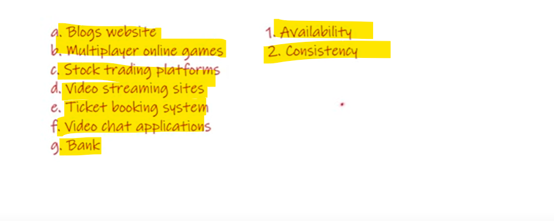
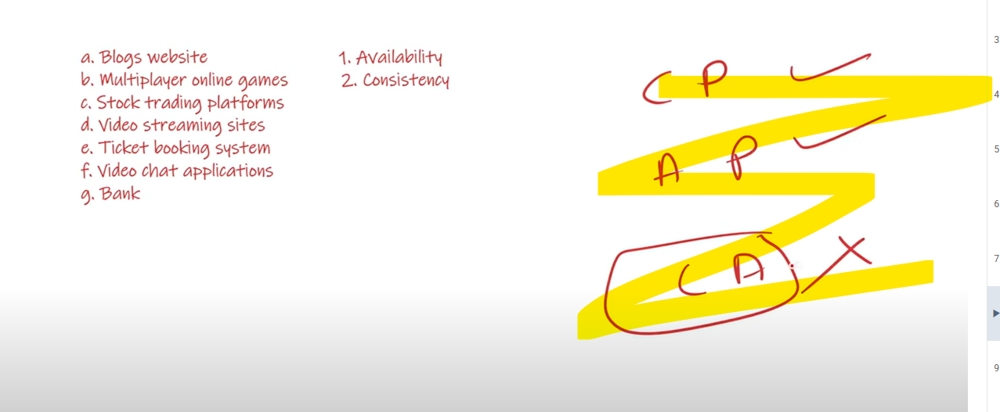
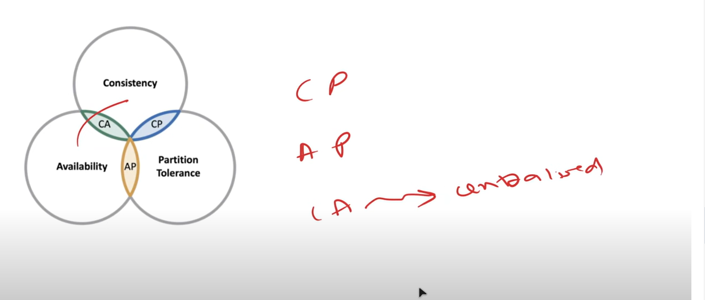

# CAP theorem

   # C - Consistency

    suppose there are 2 persons are they are requesting for the same resource then they should get the same response.

    It's not like for movie ticket for A showing 1 seat available and for B showing seat not available, data should not be inconsistent.

    I deposited to bank Rs. 100, earlier it was 0, so, now if i check balance it should show 100 not 0.

   # A - Availability

    Every time our websites should be available. It's not like how CBSE website got down when results came like a google
    website should always be available.

   # P - Partition Tolerance

    In distributed system our application divided into multiple components and they deployed in a decentralized manner. 
    which means not deployed in a one machine it deployed on a different servers. 
    
    suppose if any one of the server goes down then we say partition happened which mean network partitioned happened.
    Tolerance means we have to stop server going down so we can use replica in this case. so our application should be
    partitioned tolerance.

    

 For a Distributed system, The CAP Theorem states that It is possible to attain only two properties and the third
 properties would always be compromised. so, always in our application only 2 properties we can attain at a time.  
 
 The system requirements should define which two properties should be chosen over the network.

at a time either you can achieve CA, CP or AC, you can't achieve all three at a time.

    The System designer can select Consistency and Partition Tolerance, but the Availability would be compromised then.

    The System designer can select Partition Tolerance and Availability, but the Consistency would be compromised then.

    The System designer can select Availability and Consistency, but the Partition Tolerance would be compromised then.

 

   >>> At a time either you can achieve CA, CP or AC, you can't achieve all three at a time.

# C P 

    If we are achieving C-P then Availability won't be there. our data is consistent but not available.
    
    We already saw if we are going to make your system consistent or strongly consistent then you must have to stop DIRTY READ.

    Suppose we are having a network of 4 nodes and you want to make it highly consistent If person A has updated on 1st node
    then it will take time to update all rest 3 nodes, In between person B came and he was trying to read data from node 4, so he
    should not read a incorrect data for that we have to stop rest all 3 nodes Availability. so, availability getting compromise here.
        How The Bank websides goes down when any updates come then they compromise with availability and they keep data consistent.
        the system is always partition tolerance when one node goes down then their replica comes up.  

# A P   

    Which mean system should be available we can compromise consistency. 

    Suppose we have 4 nodes, take an example of social media I have posted one blog so it's not necessary that all the 
    users to see this post immediately while they are requesting over websites. But this is manadatory that social media
    should be available always 24/7 hrs. if they are seeing my updates after few minutes also then it's fine no problem.
    but if you stop instgram for a minutes the user experiance will go bad. 

# C A  

    In C-A you are achieving the consistency as well as availability then our system not be there partition tolerance.

    We are talking about Distributed System But when achieves Consistency & Availability then the System will be Centralized
    which mean only one Node will be present. so, when only one Node then only our data will be consistent and avaialable. 
    
    Suppose we have only one database server If I have updated here only I am updating and all the REQUESTS which is coming 
    it is coming here only, obviously data will be consistent and only one database server so it will be available also. 
    But, since only one db server and if it goes down then there will be a problem occurred, so, this is not a 
    partitioned tolerance. so, CA is a monolithic and centralized so, in this case system will not be a partition tolerance.

Example:-
=========

 

 we have some web applications and we have consistent & availability written.

     why only consistent & availability, why not partition toleramnce. In case of C-A-P we are saying we can achieve 2 things
     3rd one we can not achieve but the most important property is P - Partition Tolerance. which mean P should always be there in Application,
     which means choice comes down to C and A, so either our application will be consistent or available.

     In C-A-P theorem P is most important. you can't afford like there is some issue in our system and our application Running
     simply so, for that fault tolerance must be there in an application. 
     so either we will create our application C - P or A - P, so either consistent & partition tolerant or available & partition tolerant.
     C - A we will not create this is the Most Important thing in C-A-P Theorem. 
     
   

  *** so, In our Blog Websites P always be there we just need to choose either C or A.

  Blog Website - A  ( Available )   , If not available then person will move to other blogging websites.

  MultiPlayer Online Game - A  ( Available )   , If not available then person will move to other websites.

  Stock Trading Platform - C ( Consistent )  , data should be correct not vary from other trading platform, Availability not much matter

  Video Streaming Sites - A  ( Available )   , If not available then person will move to other websites.

  Ticket Booking System - C ( Consistent )  , Highly consistent it's not like 2 persons booked the same tickets.

  Video Chat Application  - A  ( Available )  , If down for a month then another app will come in market.

  Bank - C ( Consistent )  , Bank will always choose a consistent over availability. thats the reason always down, they update data
                             and wrong data should not get populated for that they make website down. when all data got updated then 
                             they make it available.

  

    we went through CAP Theorem, 
    
    In CAP Theorem either C-P or A-P.

    C-A we will not choose because centralization will come there because one node so not recommended.

    Either we will use Consistency or Availability depends on Business Logic.

    In case of Bank & Stock Trading then should be Consistency.

    In case Blogging Website, Video Streaming/Chating site should be Available.

    In case Swiggy or Zomato should be Available.

    

  
     

     
    